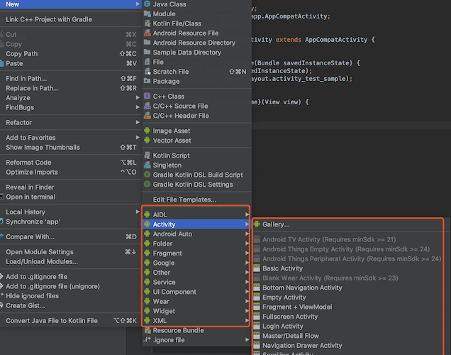
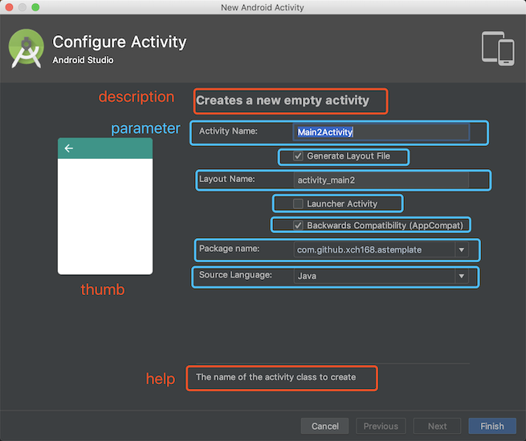

### 概述

>我们在使用Android Studio创建Activity、Fragment等等的时候，都会使用Android Studio提供的模板来简化我们创建的，使用模板时，我们只要做简单的配置，Android就能为我们生成相应的代码，所以使用模板可以提高开发的效率，接下来我们将学习如何去自定义一个符合自己项目框架的模板。

<!--more-->

### 介绍

> Android Studio模板的安装路径：`<Android Studio安装目录>/plugins/android/lib/templates`





### 模板文件结构

Android Studio中已有的`Empty Activity`模板：


模板组成结构：

- template.xml：定义模板参数
- globals.xml.ftl：定义全局变量
- recipe.xml.ftl：配置要引用的模板路径和生成的文件的路径
- root文件：存放模板文件和资源文件
- 效果缩略图

#### template.xml

```xml
<?xml version="1.0"?>
<template
    format="5"
    revision="5"
    name="Empty Activity"
    minApi="9"
    minBuildApi="14"
    description="Creates a new empty activity">

    <category value="Activity" />
    <formfactor value="Mobile" />

    <parameter
        id="activityClass"
        name="Activity Name"
        type="string"
        constraints="class|unique|nonempty"
        suggest="${layoutToActivity(layoutName)}"
        default="MainActivity"
        help="The name of the activity class to create" />

    <parameter
        id="generateLayout"
        name="Generate Layout File"
        type="boolean"
        default="true"
        help="If true, a layout file will be generated" />

    <parameter
        id="layoutName"
        name="Layout Name"
        type="string"
        constraints="layout|unique|nonempty"
        suggest="${activityToLayout(activityClass)}"
        default="activity_main"
        visibility="generateLayout"
        help="The name of the layout to create for the activity" />

    <parameter
        id="isLauncher"
        name="Launcher Activity"
        type="boolean"
        default="false"
        help="If true, this activity will have a CATEGORY_LAUNCHER intent filter, making it visible in the launcher" />

    <parameter
        id="backwardsCompatibility"
        name="Backwards Compatibility (AppCompat)"
        type="boolean"
        default="true"
        help="If false, this activity base class will be Activity instead of AppCompatActivity" />

    <parameter
        id="packageName"
        name="Package name"
        type="string"
        constraints="package"
        default="com.mycompany.myapp" />

    <!-- 128x128 thumbnails relative to template.xml -->
    <thumbs>
        <!-- default thumbnail is required -->
        <thumb>template_blank_activity.png</thumb>
    </thumbs>

    <globals file="globals.xml.ftl" />
    <execute file="recipe.xml.ftl" />

</template>
```



**说明**：

- `<template>`中的`name`对应新建`Activity`时显示的名字
- `<category>`对应New的类别为`Activity`
- `<parameter>`对应界面上蓝色框的一个项，
  - id：唯一表示，最终通过该属性值，获取用户界面上的输入值
  - name：界面上Label提示语
  - type：输入值类型
  - constraints：值约束
  - suggest：建议值，比如填写ActivityName的时候，会给出LayoutName的建议值
  - help：底部显示的提示语

#### globals.xml.ftl


#### recipe.xml.ftl


### Freemarker语法


### 自定义MVP模板


### 参考链接

1. [Android Studio自定义模板 写页面竟然可以如此轻松](https://blog.csdn.net/lmj623565791/article/details/51635533)
2. [TemplateBuilder(中文版)](https://puke3615.github.io/2017/03/06/TemplateBuilder[Chinese]/)
3. [Android Studio 轻松构建自定义模板](https://www.jianshu.com/p/fa974a5dc2ff)
4. [Android Studio Template(模板)开发](https://www.jianshu.com/p/e3548f441440)