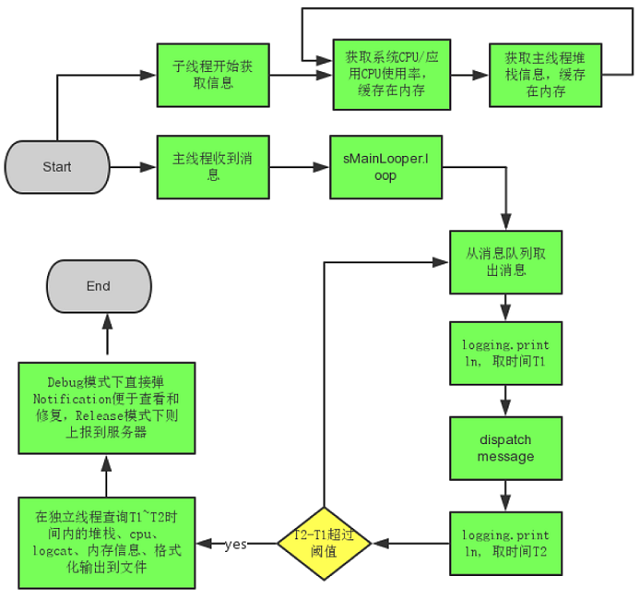

### 概述

>BlockCanary是Android平台上的一个轻量的，非侵入式的性能监控组件，可以在使用应用的时候检测主线程上的各种卡顿问题，并可通过组件提供的各种信息分析出原因并进行修复。

<!--more-->

### 使用

> 项目地址：https://github.com/markzhai/AndroidPerformanceMonitor

Step1. 配置build.gradle

```groovy
dependencies {
    // most often used way, enable notification to notify block event
    implementation 'com.github.markzhai:blockcanary-android:1.5.0'

    // this way you only enable BlockCanary in debug package
    // debugImplementation 'com.github.markzhai:blockcanary-android:1.5.0'
    // releaseImplementation 'com.github.markzhai:blockcanary-no-op:1.5.0'
}
```

Step2. 在Application中注册

```java
public class DemoApplication extends Application {
    @Override
    public void onCreate() {
        // ...
        // Do it on main process
        BlockCanary.install(this, new BlockCanaryContext()).start();
    }
}
```

Step3. 检测结果


### 原理

> 在Android中，应用的卡顿，主要是在主线程阻塞导致的。Looper是主线程的消息调度者，所以以它为突破点。

**Looper#loop()**：

> 在Looper的loop方法中，有一个Printer，它在每个Message处理的前后被调用，而如果主线程卡住了，就是`dispatchMessage`里卡住了。

```java
public static void loop() {
    // ....

    for (;;) {
        // ...
        
        // This must be in a local variable, in case a UI event sets the logger
        final Printer logging = me.mLogging;
        if (logging != null) {
            logging.println(">>>>> Dispatching to " + msg.target + " " +
                            msg.callback + ": " + msg.what);
        }

        // ...
        msg.target.dispatchMessage(msg);
        // ...

        if (logging != null) {
            logging.println("<<<<< Finished to " + msg.target + " " + msg.callback);
        }
       // ...
    }
}
```

**获取主线程的Looper**：

> 因为Looper在每个线程最多只有一个实例，所以只要获取到主线程的Looper，就可以设置一个自定义的Printer对象到里面。

```java
Looper mainLooper = Looper.getMainLooper();
```

**创建自定义Printer**

> 在Printer的println方法去计算主线程一条Message处理的时长，当时长超过设定的阈值时就判定是卡顿了。

```java
...
@Override
public void println(String x) {
    if (!mStartedPrinting) {
        mStartTimeMillis = System.currentTimeMillis();
        mStartThreadTimeMillis = SystemClock.currentThreadTimeMillis();
        mStartedPrinting = true;
    } else {
        final long endTime = System.currentTimeMillis();
        mStartedPrinting = false;
        if (isBlock(endTime)) {
            notifyBlockEvent(endTime);
        }
    }
}

private boolean isBlock(long endTime) {
    return endTime - mStartTimeMillis > mBlockThresholdMillis;
}
...
```

**设置自定义Printer到主线程Looper**：

```java
Looper.getMainLooper().setMessageLogging(mainLooperPrinter);
```

**流程图**：




### 参考链接

1. [BlockCanary — 轻松找出Android App界面卡顿元凶](https://blog.zhaiyifan.cn/2016/01/16/BlockCanaryTransparentPerformanceMonitor/)