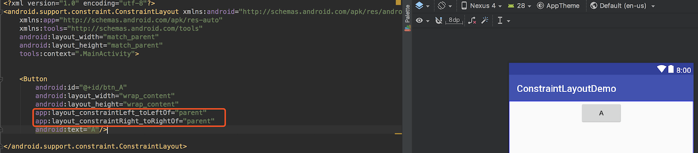
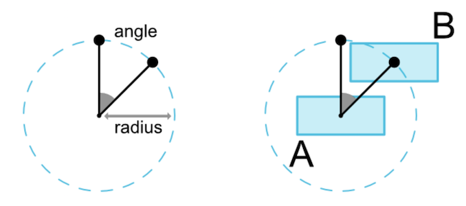
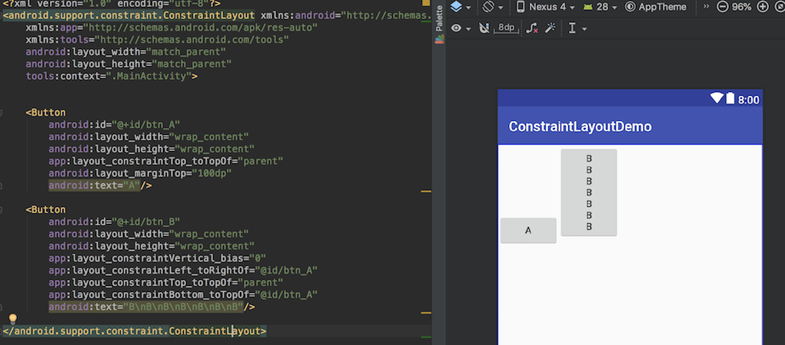
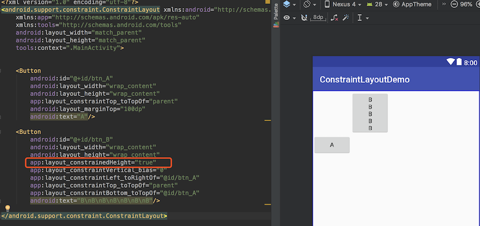
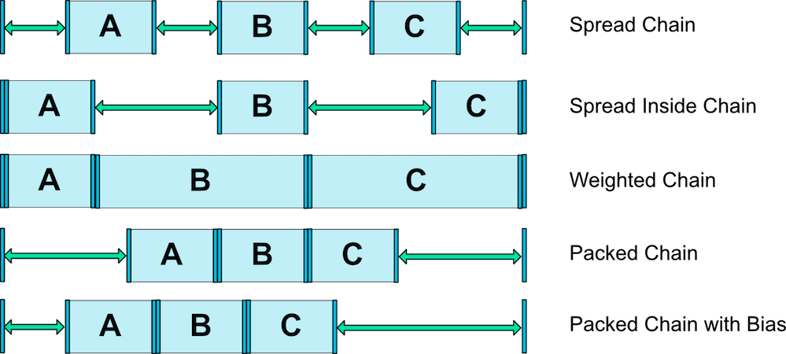
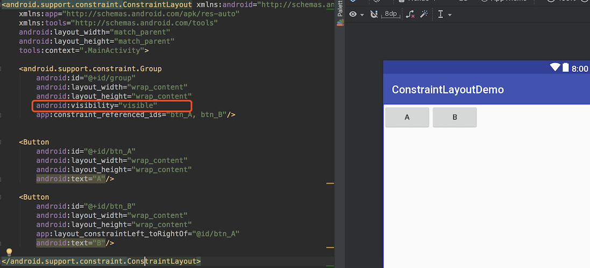

### 概述

> ConstraintLayout(约束布局)的出现是为了在Android应用布局中保持扁平的层次结构，减少布局的嵌套，为应用创建响应快速而灵敏的界面。ConstraintLayout可以替代其他布局。

<!--more-->

### 导库

```groovy
implementation 'com.android.support.constraint:constraint-layout:1.1.2'
```

### ConstraintLayout的用法

#### Relative position

> ConstraintLayout具有RelativeLayout的能力，可以将一个控件置于相对于另一个控件的位置。

**示例**：将B按钮放在A按钮的右边


```xml
<Button android:id="@+id/buttonA" ... />

<Button android:id="@+id/buttonB" ...
        app:layout_constraintLeft_toRightOf="@+id/buttonA" /> <!--B控件的左边与A控件右边对齐-->
```

**控件的边界名**：


**其他相关属性**

- layout_constraintLeft_toLeftOf
- layout_constraintLeft_toRightOf
- layout_constraintRight_toLeftOf
- layout_constraintRight_toRightOf
- layout_constraintTop_toTopOf
- layout_constraintTop_toBottomOf
- layout_constraintBottom_toTopOf
- layout_constraintBottom_toBottomOf
- layout_constraintBaseline_toBaselineOf
- layout_constraintStart_toEndOf
- layout_constraintStart_toStartOf
- layout_constraintEnd_toStartOf
- layout_constraintEnd_toEndOf

**这些属性会引用另一个控件的`id`或者`parent`(这会引用父容器，即ConstraintLayout)**

```xml
<Button android:id="@+id/buttonB" ...
        app:layout_constraintLeft_toLeftOf="parent" />
```

#### Margins

> 在ConstraintLayout中，layout_margin及其子属性的作用都被复写，margin属性只对其相约束的View起作用。


**示例**1：有约束属性


**示例**2：没有约束属性，margin就会失效


#### GONE Margins

> 当被约束的目标对象的可见性为`View.GONE`，可以使用`gone margin`来设置，它只会在目标Target为`GONE`的时候生效。

**相关属性**：

- layout_goneMarginStart
- layout_goneMarginEnd
- layout_goneMarginLeft
- layout_goneMarginTop
- layout_goneMarginRight
- layout_goneMarginBottom

**示例1**：


**示例2**：


#### Bias

在ConstraintLayout中没有直接的属性让一个控件水平居中，或者竖直居中，可以使用如下方式：



如果想要将控件在水平方向偏向左、或者在竖直方向偏向一个方向，就可以配合使用`bias`属性：

- layout_constraintHorizontal_bias
- layout_constraintVertical_bias

> 居中情况下，bias的默认值为0.5，取值范围是`0~1`，是以left或top为始起边界。

**示例**：


#### Circular positioning(圆形定位)

> 可以使用角度和距离来约束一个控件相对于另一个控件的位置。



**相关属性**：

- layout_constraintCircle：参照控件的id
- layout_constraintCircleRadius：两个控件中心连线的距离
- layout_constraintCircleAngle：当前View的中心与目标View的中心的连线与Y轴方向的夹角（取值：0~360）

**示例**：


#### Dimensions constraints

> ConstraintLayout中有3中方式来设置子View的宽高尺寸：
>
> - **Xdp**，X为具体数值
> - **WARP_CONTENT** 
> - **0dp**，0dp代表`MATCH_CONSTRAINT`，ConstraintLayout不推荐使用~~MATCH_PARENT~~

##### MATCH_CONSTRAINT

**示例**1：0dp的使用，可以看到，View的宽度就是父容器的宽度


**示例2**：B按钮被拉伸


当控件的尺寸被设置为`MATCH_CONSTRAINT`时，默认情况下尺寸会被设置成占用所有可用空间，可用使用下面几个属性进行约束：

- layout_constraintWidth_min
- layout_constraintHeight_min
- layout_constraintWidth_max
- layout_constraintHeight_max
- layout_constraintWidth_percent
- layout_constraintHeight_percent

##### WRAP_CONTENT : enforcing constraints（强制约束）

> 如果一个View的尺寸被设置为`wrap_content`，那么当View的内容太多时，可能会超出约束规定的范围，约束布局提供了两个属性来限制View的尺寸:
>
> - layout_constrainedWidth="true|false"，默认为false
> - layout_constrainedHeight="true|false"，默认为false
> 

**示例1**：默认情况下，B控件由于内容较多，高度超出了约束规定的范围。



**示例2**：限制高度



##### Percent dimension

使用百分比步骤

- 需要将宽或高设置为`MATCH_CONSTRAINT`(0dp)
- 设置`layout_constraintWidth_percent`或`layout_constraintHeight_percent`，值为`0~1`

**示例**：


#### Ratio

> ConstrainLayout提供了`ratio`属性，用来限制View的宽高比例。
>
> 使用`Ratio`属性，宽高两个尺寸中至少要一个是`MATCH_CONSTRAINT`(0dp)
>
> 默认情况下，1:2，表示宽:高，宽为1，高为2
>
> 宽高都为`MATCH_CONSTRAINT`时，可以在比例前加W或者H：
>
> `W,1:2`：表示宽=2，高=1，即H:W = 1:2
>
> `H,1:2`：表示高=2，宽=1，即W:H = 1:2

**示例1**：2:1


**示例2**：H,16:9（宽度占满父控件，约束高度为宽的9/16）


**示例2**：W,1:5（高度占满父控件，宽度为高度的1/5）


**示例3**：指定宽度为屏幕一半，并保持比例


#### Chains

> 链使我们能够对一组在水平或竖直方向互相关联的控件的属性进行统一管理。
>
> 成为链条的条件：
>
> **一组控件它们通过一个双向的约束关系链接起来，并且链的属性由一条链的头结点控制。**


**示例**：


##### Chain style

设定链条样式的属性：

- layout_constraintHorizontal_chainStyle：水平链条的样式
- layout_constraintVertical_chainStyle：竖直链条的样式

**链的样式**:



##### Weighted chains

> 权重链，宽或高需要设置为`MATCH_CONSTRAINT`。
>
> 使用`layout_constraintHorizontal_weight`或`layout_constraintVertical_weight`设置对应的权重

**示例**：


### constraint其他组件的用法

#### Guideline

> Guideline，是一个辅助控件，可见性为`GONE`，主要作用是充当一个锚点。

**设置Guidline的方向**：

- android:orientation="horizontal"：高度0dp，宽度与父容器等宽
- android:orientation="vertical"：宽度0dp，高度与父容器等高

**设置Guidline的位置**：

- layout_constraintGuide_begin：距离父容器左边或者顶部的距离
- layout_constraintGuide_end：距离父容器右边或者底部的距离
- layout_constraintGuide_percent：距离父容器左边或者顶部的距离占父容器的宽或者高的百分比

**示例**


#### Barrier

> Barrier，译为屏障，是一个虚拟的辅助控件，用来防止它引用的View的位置超过自己。

**相关属性**：

- barrierDirection="left | top | right | bottom | start | end"：设置屏障的方向
- constraint_referenced_ids="id1,id2,...,idn"：设置要限制在屏障内的控件

**示例**：


#### Group

> Group，用于控制多个控件的可见性。



#### Placeholder

> Placeholder，占位符，可以用来放置其他View，用这个可以写一些布局模板。

**示例**：

模板文件：


> **tools:parentTag**：设为ConstraintLayout，使得编辑器将当前merge标签当做约束布局来预览。
>
> **content**：是要填入这个占位符的View的id。

引用模板：


### 参考链接

1. [ConstraintLayout](https://developer.android.com/reference/android/support/constraint/ConstraintLayout)
2. [实战篇ConstraintLayout的崛起之路](https://www.jianshu.com/p/a74557359882)
3. [ConstraintLayout 完全解析 快来优化你的布局吧](https://blog.csdn.net/lmj623565791/article/details/78011599)
4. [Android新特性介绍，ConstraintLayout完全解析](https://blog.csdn.net/guolin_blog/article/details/53122387)
5. [解析ConstraintLayout的性能优势](https://mp.weixin.qq.com/s/gGR2itbY7hh9fo61SxaMQQ)
6. [ConstraintLayout学习笔记](https://www.jianshu.com/p/4290b86289c8)