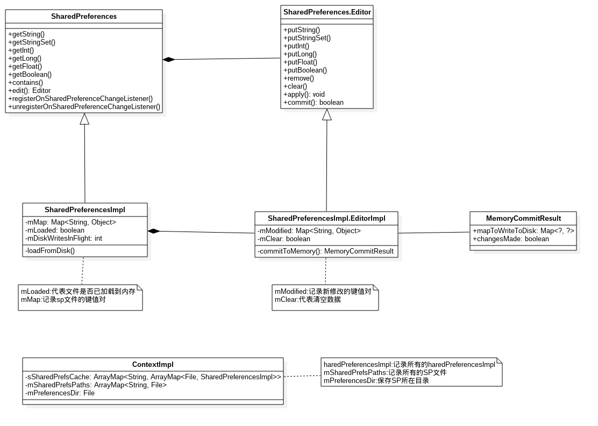
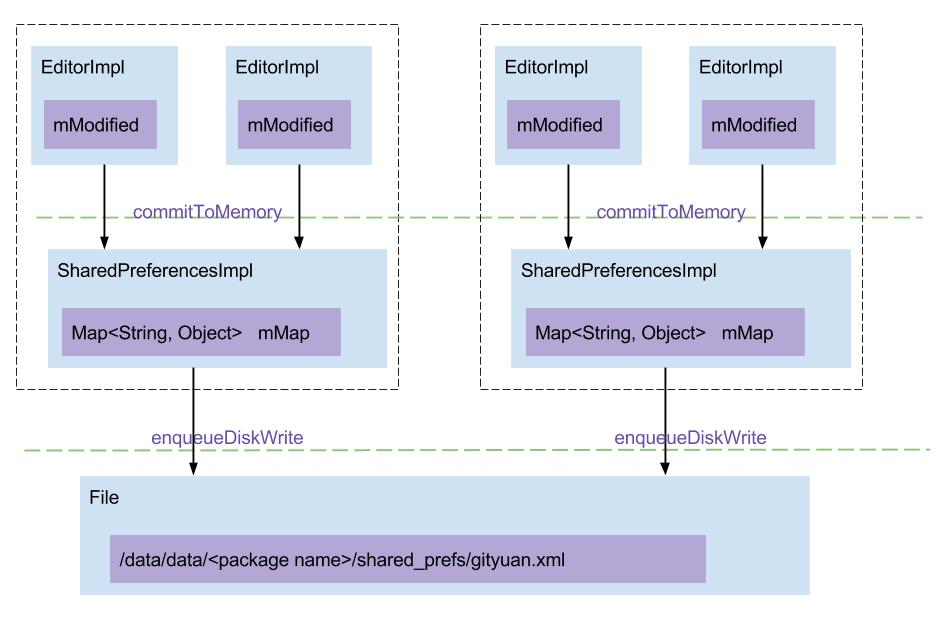

### 概述

>SharedPreferences(简称SP)是Android中常用的数据存储方式，SP采用key-value(键值对)形式，主要用于轻量级的数据存储，尤其适合保存应用的配置参数，但不建议使用SP来存储大规模的数据，可能会降低性能。

<!--more-->

> SP采用XML文件格式来保存数据，该文件位于`/data/data/<packageName>/shared_prefs/`。

### 使用示例

```java
// 加载SP文件数据,“my_prefs”为文件名
SharedPreferences sp = getSharedPreferences("my_prefs", Context.MODE_PRIVATE);

// 保存数据
SharedPreferences.Editor editor = sp.edit();
editor.putString("blog", "www.xucanhui.com");
// 提交数据：同步方式，有返回值表示数据保存是否成功
boolean result = editor.commit(); 
// 提交数据：异步方式，没有返回值
// editor.apply()

// 读取数据
String blog = sp.getString("blog", "");
```

my_prefs.xml文件内容：

```xml
<?xml version='1.0' encoding='utf-8' standalone='yes' ?>
<map>
    <string name="blog">www.xucanhui.com</string>
</map>
```

### 架构

> 来源：http://gityuan.com/2017/06/18/SharedPreferences/

#### 类图



**说明**：SharedPreferences与Editor只是两个接口，SharedPreferencesImpl和EditorImp分别实现了对应的接口。另外，ContextImpl记录着SharedPreferences的重要数据，如下：

- sSharedPrefsCache：以包名为key，二级key是SP文件，以SharedPreferencesImp为value的嵌套map结构，sSharedPrefsCache是静态成员变量，每个进程只有唯一的一份，且由ContextImpl.class锁保护。
- mSharedPrefsPaths：记录所有的SP文件，以文件名为key，具体文件为value的map结构。
- mPreferencesDir：是值SP所在目录，即`/data/data/<packageName>/shared_prefs/`

#### 工作流程



**说明**：

1. putXxx()操作：把数据写入到EditorImpl.mModified；

2. apply()或者commit()操作：

   a. 先调用`commitToMemory()`，将数据同步到SharedPreferencesImpl的mMap，并保存到MemoryCommitResult的`mapToWriteToDisk`；

   b. 再调用`enqueueDiskWrite()`，写入到磁盘文件；在这之前把原有数据保存到`.bak`后缀的文件，用于在写磁盘的过程出现任何异常可恢复数据。

3. getXxx()操作：从SharedPreferencesImpl.mMap读取数据。

### 源码分析(API 28)

#### 获取SharedPreferences

> 可以通过`Activity.getPreferences(mode)`、`PreferenceManager.getDefaultSharedPreferences(context)`或者`Context.getSharedPreferences(name,mode)`来获取SharedPreferences实例，
>
> 最终调用的是ContextImpl的getSharedPreferences(name, mode)。

**ContextImpl#getSharedPreferences(name, mode)**：

```java
class ContextImpl extends Context {
    
    @GuardedBy("ContextImpl.class")
    private ArrayMap<String, File> mSharedPrefsPaths;
    
    // ...
    
    @Override
    public SharedPreferences getSharedPreferences(String name, int mode) { 
        // ...
        
        File file;
        synchronized (ContextImpl.class) {
            if (mSharedPrefsPaths == null) {
                mSharedPrefsPaths = new ArrayMap<>();
            }
            // 先从mSharedPrefsPaths查询是否存在相应文件
            file = mSharedPrefsPaths.get(name);
            if (file == null) {
                // 如果文件不存在，则创建新的文件
                file = getSharedPreferencesPath(name);
                // 将新创建的文件保存到mSharedPrefsPaths，以文件名为key
                mSharedPrefsPaths.put(name, file);
            }
        }
        return getSharedPreferences(file, mode);
    }
    
    @Override
    public File getSharedPreferencesPath(String name) {
        return makeFilename(getPreferencesDir(), name + ".xml");
    }
    
    private File getPreferencesDir() {
        synchronized (mSync) {
            if (mPreferencesDir == null) {
                // 创建目录/data/data/<packageName>/shared_prefs/
                mPreferencesDir = new File(getDataDir(), "shared_prefs");
            }
            return ensurePrivateDirExists(mPreferencesDir);
        }
    }
}
```

**ContextImpl#getSharedPreferences(file, mode)**：

```java
@Override
public SharedPreferences getSharedPreferences(File file, int mode) {
    SharedPreferencesImpl sp;
    synchronized (ContextImpl.class) {
        final ArrayMap<File, SharedPreferencesImpl> cache = getSharedPreferencesCacheLocked();
        sp = cache.get(file);
        if (sp == null) {
            checkMode(mode);
            if (getApplicationInfo().targetSdkVersion >= android.os.Build.VERSION_CODES.O) {
                if (isCredentialProtectedStorage()
                    && !getSystemService(UserManager.class)
                    .isUserUnlockingOrUnlocked(UserHandle.myUserId())) {
                    throw new IllegalStateException("SharedPreferences in credential encrypted "
                                                    + "storage are not available until after user is unlocked");
                }
            }
            // 创建SharedPreferencesImpl
            sp = new SharedPreferencesImpl(file, mode);
            cache.put(file, sp);
            return sp;
        }
    }
    // 指定多进程模式，则当文件被其他进程改变是，则会重新加载
    if ((mode & Context.MODE_MULTI_PROCESS) != 0 ||
        getApplicationInfo().targetSdkVersion < android.os.Build.VERSION_CODES.HONEYCOMB) {
        // If somebody else (some other process) changed the prefs
        // file behind our back, we reload it.  This has been the
        // historical (if undocumented) behavior.
        sp.startReloadIfChangedUnexpectedly();
    }
    return sp;
}

@GuardedBy("ContextImpl.class")
private ArrayMap<File, SharedPreferencesImpl> getSharedPreferencesCacheLocked() {
    if (sSharedPrefsCache == null) {
        sSharedPrefsCache = new ArrayMap<>();
    }

    final String packageName = getPackageName();
    ArrayMap<File, SharedPreferencesImpl> packagePrefs = sSharedPrefsCache.get(packageName);
    if (packagePrefs == null) {
        packagePrefs = new ArrayMap<>();
        sSharedPrefsCache.put(packageName, packagePrefs);
    }

    return packagePrefs;
}
```

**SharedPreferencesImpl初始化**：

**SharedPreferencesImpl.java**

```java
SharedPreferencesImpl(File file, int mode) {
    mFile = file;
    // 创建.bak后缀的备份文件，用于在发生异常时，可以通过备份文件来恢复数据
    mBackupFile = makeBackupFile(file);
    mMode = mode;
    mLoaded = false;
    mMap = null;
    mThrowable = null;
    startLoadFromDisk();
}
```

**SharedPreferencesImpl#startLoadFromDisk()**：

```java
private void startLoadFromDisk() {
    synchronized (mLock) {
        mLoaded = false;
    }
    // 通过工作线程读取文件数据到mMap
    new Thread("SharedPreferencesImpl-load") {
        public void run() {
            loadFromDisk();
        }
    }.start();
}

private void loadFromDisk() {
    synchronized (mLock) {
        if (mLoaded) {
            return;
        }
        if (mBackupFile.exists()) {
            mFile.delete();
            mBackupFile.renameTo(mFile);
        }
    }

    // Debugging
    if (mFile.exists() && !mFile.canRead()) {
        Log.w(TAG, "Attempt to read preferences file " + mFile + " without permission");
    }

    Map<String, Object> map = null;
    StructStat stat = null;
    Throwable thrown = null;
    try {
        stat = Os.stat(mFile.getPath());
        if (mFile.canRead()) {
            BufferedInputStream str = null;
            try {
                str = new BufferedInputStream(
                    new FileInputStream(mFile), 16 * 1024);
                map = (Map<String, Object>) XmlUtils.readMapXml(str);
            } catch (Exception e) {
                Log.w(TAG, "Cannot read " + mFile.getAbsolutePath(), e);
            } finally {
                IoUtils.closeQuietly(str);
            }
        }
    } catch (ErrnoException e) {
        // An errno exception means the stat failed. Treat as empty/non-existing by
        // ignoring.
    } catch (Throwable t) {
        thrown = t;
    }

    synchronized (mLock) {
        mLoaded = true;
        mThrowable = thrown;

        // It's important that we always signal waiters, even if we'll make
        // them fail with an exception. The try-finally is pretty wide, but
        // better safe than sorry.
        try {
            if (thrown == null) {
                if (map != null) {
                    mMap = map;
                    mStatTimestamp = stat.st_mtim;
                    mStatSize = stat.st_size;
                } else {
                    mMap = new HashMap<>();
                }
            }
            // In case of a thrown exception, we retain the old map. That allows
            // any open editors to commit and store updates.
        } catch (Throwable t) {
            mThrowable = t;
        } finally {
            mLock.notifyAll();
        }
    }
}
```

> **获取SharedPreferences总结**：
>
> 1. 首次使用则创建相应xml文件；
> 2. 异步加载文件内容到内存，此时执行getXxx()和edit()方法都是阻塞等待的，直到文件数据全部加载到内存；
> 3. 一旦数据完全加载到内存，后续的getXxx()则是直接访问内存。

#### 获取数据

**SharedPreferencesImpl#getString(key, defValue)**：

```java
public String getString(String key, @Nullable String defValue) {
    synchronized (mLock) {
        // 检查数据是否加载完成
        awaitLoadedLocked();
        String v = (String)mMap.get(key);
        return v != null ? v : defValue;
    }
}

private void awaitLoadedLocked() {
    if (!mLoaded) {
        BlockGuard.getThreadPolicy().onReadFromDisk();
    }
    while (!mLoaded) {
        try {
            // 当没有加载完成，则进入等待状态
            mLock.wait();
        } catch (InterruptedException unused) {
        }
    }
    if (mThrowable != null) {
        throw new IllegalStateException(mThrowable);
    }
}
```

#### 编辑数据

获取Editor编辑器实例：`SharedPreferencesImpl#edit()`

```java
public Editor edit() {
    synchronized (mLock) {
        // 等待数据加载完成
        awaitLoadedLocked();
    }
	// 创建EditorImpl实例
    return new EditorImpl();
}
```

**EditorImpl#putString(key, value)**：

```java
public final class EditorImpl implements Editor {
    
    @GuardedBy("mEditorLock")
    private final Map<String, Object> mModified = new HashMap<>();
    
    @GuardedBy("mEditorLock")
    private boolean mClear = false;
    
    // ...
    
	// 插入数据
    public Editor putString(String key, @Nullable String value) {
        synchronized (mEditorLock) {
            // 插入数据，暂存到mModified
            mModified.put(key, value);
            return this;
        }
    }
    
    // 移除数据
    public Editor remove(String key) {
        synchronized (mEditorLock) {
            mModified.put(key, this);
            return this;
        }
    }

    // 清空全部数据
    public Editor clear() {
        synchronized (mEditorLock) {
            mClear = true;
            return this;
        }
    }
}
```

#### 保存数据

> 保存数据，主要是调用`commit()`和`apply()`方法来完成的。

**EditorImpl#commit()**

```java
public boolean commit() {
	// ...

    // 将数据更新到内存
    MemoryCommitResult mcr = commitToMemory();
    // 将内存数据同步到文件
    SharedPreferencesImpl.this.enqueueDiskWrite(
        mcr, null /* sync write on this thread okay */);
    try {
        // 进入等待状态，直到写入文件的操作完成
        mcr.writtenToDiskLatch.await();
    } catch (InterruptedException e) {
        return false;
    }
    // 通知监听器，并在主线程回调onSharedPreferenceChanged()方法
    notifyListeners(mcr);
    // 返回文件操作的结果
    return mcr.writeToDiskResult;
}
```

**EditorImpl#commitToMemory()**

```java
private MemoryCommitResult commitToMemory() {
    long memoryStateGeneration;
    List<String> keysModified = null;
    Set<OnSharedPreferenceChangeListener> listeners = null;
    Map<String, Object> mapToWriteToDisk;

    synchronized (SharedPreferencesImpl.this.mLock) {
        if (mDiskWritesInFlight > 0) {
            mMap = new HashMap<String, Object>(mMap);
        }
        mapToWriteToDisk = mMap;
        mDiskWritesInFlight++;

        boolean hasListeners = mListeners.size() > 0;
        if (hasListeners) {
            keysModified = new ArrayList<String>();
            listeners = new HashSet<OnSharedPreferenceChangeListener>(mListeners.keySet());
        }

        synchronized (mEditorLock) {
            boolean changesMade = false;
			// 当mClear为true，则直接清空mMap
            if (mClear) {
                if (!mapToWriteToDisk.isEmpty()) {
                    changesMade = true;
                    mapToWriteToDisk.clear();
                }
                mClear = false;
            }

            for (Map.Entry<String, Object> e : mModified.entrySet()) {
                String k = e.getKey();
                Object v = e.getValue();
               	// this是一个特殊值，当v为空，相当于remove该条数据
                if (v == this || v == null) {
                    if (!mapToWriteToDisk.containsKey(k)) {
                        continue;
                    }
                    mapToWriteToDisk.remove(k);
                } else {
                    if (mapToWriteToDisk.containsKey(k)) {
                        Object existingValue = mapToWriteToDisk.get(k);
                        if (existingValue != null && existingValue.equals(v)) {
                            continue;
                        }
                    }
                    mapToWriteToDisk.put(k, v);
                }
				// 表示数据有改变
                changesMade = true;
                if (hasListeners) {
                    keysModified.add(k);
                }
            }
			// 清空mModified的数据
            mModified.clear();

            if (changesMade) {
                mCurrentMemoryStateGeneration++;
            }

            memoryStateGeneration = mCurrentMemoryStateGeneration;
        }
    }
    return new MemoryCommitResult(memoryStateGeneration, keysModified, listeners,
                                  mapToWriteToDisk);
}
```

**EditorImpl#enqueueDiskWrite()**

```java
private void enqueueDiskWrite(final MemoryCommitResult mcr,
                              final Runnable postWriteRunnable) {
    final boolean isFromSyncCommit = (postWriteRunnable == null);

    final Runnable writeToDiskRunnable = new Runnable() {
        @Override
        public void run() {
            synchronized (mWritingToDiskLock) {
                // 执行文件写入操作
                writeToFile(mcr, isFromSyncCommit);
            }
            synchronized (mLock) {
                mDiskWritesInFlight--;
            }
            if (postWriteRunnable != null) {
                postWriteRunnable.run();
            }
        }
    };

    // 使用commit方法，会进入这个分支，在当前线程执行
    if (isFromSyncCommit) {
        boolean wasEmpty = false;
        synchronized (mLock) {
            wasEmpty = mDiskWritesInFlight == 1;
        }
        if (wasEmpty) {
            writeToDiskRunnable.run();
            return;
        }
    }

    // 使用apply方法，会执行该句，将任务放入单线程的线程池中执行
    QueuedWork.queue(writeToDiskRunnable, !isFromSyncCommit);
}
```

**EditorImpl#writeToFile()**

```java
private void writeToFile(MemoryCommitResult mcr, boolean isFromSyncCommit) {
    // ...

    boolean fileExists = mFile.exists();

    if (fileExists) {
        boolean needsWrite = false;

        // Only need to write if the disk state is older than this commit
        if (mDiskStateGeneration < mcr.memoryStateGeneration) {
            if (isFromSyncCommit) {
                needsWrite = true;
            } else {
                synchronized (mLock) {
                    // No need to persist intermediate states. Just wait for the latest state to
                    // be persisted.
                    if (mCurrentMemoryStateGeneration == mcr.memoryStateGeneration) {
                        needsWrite = true;
                    }
                }
            }
        }

        // 没有改变，直接返回
        if (!needsWrite) {
            mcr.setDiskWriteResult(false, true);
            return;
        }

        boolean backupFileExists = mBackupFile.exists();
        if (!backupFileExists) {
            // 当备份文件不存在，则把mFile重命名为备份文件
            if (!mFile.renameTo(mBackupFile)) {
                Log.e(TAG, "Couldn't rename file " + mFile
                      + " to backup file " + mBackupFile);
                mcr.setDiskWriteResult(false, false);
                return;
            }
        } else {
            // 否则，直接删除mFile
            mFile.delete();
        }
    }

    try {
        FileOutputStream str = createFileOutputStream(mFile);

        if (str == null) {
            mcr.setDiskWriteResult(false, false);
            return;
        }
        // 将mMap全部信息写入文件
        XmlUtils.writeMapXml(mcr.mapToWriteToDisk, str);

        writeTime = System.currentTimeMillis();

        FileUtils.sync(str);

        fsyncTime = System.currentTimeMillis();

        str.close();
        ContextImpl.setFilePermissionsFromMode(mFile.getPath(), mMode, 0);

        try {
            final StructStat stat = Os.stat(mFile.getPath());
            synchronized (mLock) {
                mStatTimestamp = stat.st_mtim;
                mStatSize = stat.st_size;
            }
        } catch (ErrnoException e) {
            // Do nothing
        }

        if (DEBUG) {
            fstatTime = System.currentTimeMillis();
        }

        // 写入成功，删除备份文件
        mBackupFile.delete();

        mDiskStateGeneration = mcr.memoryStateGeneration;

        // 返回写入成功，唤醒等待线程
        mcr.setDiskWriteResult(true, true);

        return;
    } catch (XmlPullParserException e) {
        Log.w(TAG, "writeToFile: Got exception:", e);
    } catch (IOException e) {
        Log.w(TAG, "writeToFile: Got exception:", e);
    }

    // 如果文件写入操作失败，则删除未成功写入的文件
    if (mFile.exists()) {
        if (!mFile.delete()) {
            Log.e(TAG, "Couldn't clean up partially-written file " + mFile);
        }
    }
    // 返回写入失败，唤醒等待线程
    mcr.setDiskWriteResult(false, false);
}
```

**EditorImpl#apply()**

```java
public void apply() {
    final long startTime = System.currentTimeMillis();

    // 把数据更新到内存
    final MemoryCommitResult mcr = commitToMemory();
    final Runnable awaitCommit = new Runnable() {
        @Override
        public void run() {
            try {
                // 进入等待状态
                mcr.writtenToDiskLatch.await();
            } catch (InterruptedException ignored) {
            }
        }
    };

    QueuedWork.addFinisher(awaitCommit);

    Runnable postWriteRunnable = new Runnable() {
        @Override
        public void run() {
            awaitCommit.run();
            QueuedWork.removeFinisher(awaitCommit);
        }
    };

    // 将数据以异步的方式写入文件
    SharedPreferencesImpl.this.enqueueDiskWrite(mcr, postWriteRunnable);

    notifyListeners(mcr);
}
```

### 性能优化

#### IO瓶颈

> IO瓶颈是造成SP性能差的最大原因，解决IO瓶颈，80%的性能问题就解决了。

SP的IO瓶颈包括`读取数据到内存`与`数据写入磁盘`两部分。

1. 读取数据到内存有两个场景会触发：

   a. SP文件没有被加载到内存时，调用getSharedPreferences方法会初始化文件并读入内存。

   b. 版本低于Android-H或使用了MULTI_PROCESS标记时，每次调用getSharedPreference方法时都会读入。

   **优化**：

   >我们可以优化的便是b了，每次加载数据到内存太过影响效率，但H以下版本已经很低了，基本可以忽略。
   >
   >对于MULTI_PROCESS，可以采用ContentProvider等其他方式，效率更好，而且可避免SP数据丢失的情况。

2. 数据写入到磁盘也有两个场景会触发：

   a. Editor的commit方法，每次执行时同步写入磁盘。

   b. Editor的apply方法，每次执行时在单线程池中写入磁盘，异步写入。

   **优化**：

   >commit和apply的方法区别在于同步写入和异步写入，以及是否需要返回值。
   >
   >在不需要返回值的情况下，使用apply方法可以极大的提高性能。
   >
   >同时，多个写入操作可以合并为一个commit/apply，将多个写入操作合并后也能提高IO性能。

#### 锁性能差

1. SP的get操作，会锁定SharedPreferences对象，互斥其他操作。

2. SP的put操作，edit()及commitToMemory会锁定SharedPreferences对象，put操作会锁定Editor对象，写入磁盘更会锁定一个写入锁。

**优化**：

> 由于锁的缘故，SP操作并发时，耗时会增加。减少锁耗时，是一个优化点。
>
> 由于读写操作的锁均是SP实例对象的，将数据分拆到不同的sp文件中，便是减少锁耗时的直接方案。
>
> 降低单文件访问频率，多文件均摊访问，以减少锁耗时。

#### 优化总结

> - 强烈建议不要在sp里面存储特别大的key/value, 有助于减少卡顿/anr；
> - 请不要高频地使用apply, 尽可能地批量提交;commit直接在主线程操作, 更要注意了；
> - 不要使用MODE_MULTI_PROCESS；
> - 高频写操作的key与高频读操作的key可以适当地拆分文件, 由于减少同步锁竞争；
> - 不要一上来就执行getSharedPreferences().edit(), 应该分成两大步骤来做, 中间可以执行其他代码；
> - 不要连续多次edit(), 应该获取一次获取edit(),然后多次执行putxxx(), 减少内存波动; 经常看到大家喜欢封装方法, 结果就导致这种情况的出现；
> - 每次commit时会把全部的数据更新的文件, 所以整个文件是不应该过大的, 影响整体性能。

### 参考链接

1. [SharedPreferences](https://developer.android.com/reference/android/content/SharedPreferences.html)
2. [全面剖析SharedPreferences](http://gityuan.com/2017/06/18/SharedPreferences/)
3. [SharedPreferences优化总结](https://www.cnblogs.com/puff/p/5530825.html)
4. [Best Practice - SharedPreferences](https://yakivmospan.com/blog/best-practice-shared-preferences/)
5. [Pros and Cons of SQLite and Shared Preferences](https://stackoverflow.com/questions/6276358/pros-and-cons-of-sqlite-and-shared-preferences)
6. [庖丁解牛之SharedPreferences超级大卡顿](https://www.jianshu.com/p/40e42da910e2)

