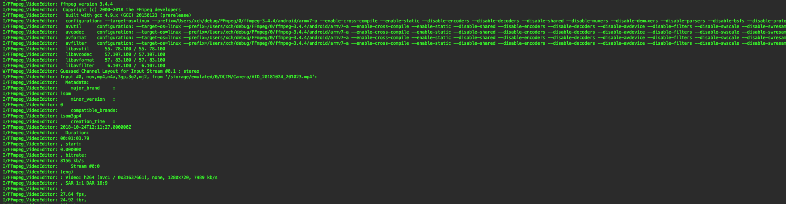
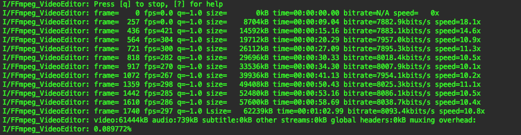

### 概述

>在日常Android开发中，我们都是通过Logcat来查看日志，但是将FFmpeg移植到Android上，无法在Logcat中查看调试信息而无法分析错误。本文将介绍如何配置来将FFmpeg的信息输出到Logcat。

<!--more-->

### av_log_set_callback

> FFmpeg中的av_log_set_callback函数用来注册FFmpeg日志输出的回调接口。

在FFmpeg源码中的ffmpeg.c文件的main函数中有av_log_set_callback的调用，而log_callback_null是个空的回调函数，一个思路是可以直接在该回调函数写打印代码：

```c
int main(int argc, char **argv)
{
    // 省略其他代码...
    av_log_set_callback(log_callback_null);
    // 省略其他代码...
}

static void log_callback_null(void *ptr, int level, const char *fmt, va_list vl)
{
}

```

### 编写android_log.h头文件

```c
#include <android/log.h>
static int use_log_report = 0;


#define FF_LOG_TAG     "FFmpeg_VideoEditor"


#define FF_LOG_UNKNOWN        ANDROID_LOG_UNKNOWN
#define FF_LOG_DEFAULT        ANDROID_LOG_DEFAULT


#define FF_LOG_VERBOSE        ANDROID_LOG_VERBOSE
#define FF_LOG_DEBUG          ANDROID_LOG_DEBUG
#define FF_LOG_INFO           ANDROID_LOG_INFO
#define FF_LOG_WARN           ANDROID_LOG_WARN
#define FF_LOG_ERROR          ANDROID_LOG_ERROR
#define FF_LOG_FATAL          ANDROID_LOG_FATAL
#define FF_LOG_SILENT         ANDROID_LOG_SILENT

// 打印可变参数
#define VLOG(level, TAG, ...)    ((void)__android_log_vprint(level, TAG, __VA_ARGS__))
#define VLOGV(...)  VLOG(FF_LOG_VERBOSE,   FF_LOG_TAG, __VA_ARGS__)
#define VLOGD(...)  VLOG(FF_LOG_DEBUG,     FF_LOG_TAG, __VA_ARGS__)
#define VLOGI(...)  VLOG(FF_LOG_INFO,      FF_LOG_TAG, __VA_ARGS__)
#define VLOGW(...)  VLOG(FF_LOG_WARN,      FF_LOG_TAG, __VA_ARGS__)
#define VLOGE(...)  VLOG(FF_LOG_ERROR,     FF_LOG_TAG, __VA_ARGS__)


#define ALOG(level, TAG, ...)    ((void)__android_log_print(level, TAG, __VA_ARGS__))
#define ALOGV(...)  ALOG(FF_LOG_VERBOSE,   FF_LOG_TAG, __VA_ARGS__)
#define ALOGD(...)  ALOG(FF_LOG_DEBUG,     FF_LOG_TAG, __VA_ARGS__)
#define ALOGI(...)  ALOG(FF_LOG_INFO,      FF_LOG_TAG, __VA_ARGS__)
#define ALOGW(...)  ALOG(FF_LOG_WARN,      FF_LOG_TAG, __VA_ARGS__)
#define ALOGE(...)  ALOG(FF_LOG_ERROR,     FF_LOG_TAG, __VA_ARGS__)

#define LOGE(format, ...)  __android_log_print(ANDROID_LOG_ERROR, FF_LOG_TAG, format, ##__VA_ARGS__)
#define LOGI(format, ...)  __android_log_print(ANDROID_LOG_INFO,  FF_LOG_TAG, format, ##__VA_ARGS__)


// 原样输出FFmpeg日志
static void ffp_log_callback_brief(void *ptr, int level, const char *fmt, va_list vl)
{
    int ffplv = FF_LOG_VERBOSE;
    if (level <= AV_LOG_ERROR)
        ffplv = FF_LOG_ERROR;
    else if (level <= AV_LOG_WARNING)
        ffplv = FF_LOG_WARN;
    else if (level <= AV_LOG_INFO)
        ffplv = FF_LOG_INFO;
    else if (level <= AV_LOG_VERBOSE)
        ffplv = FF_LOG_VERBOSE;
    else
        ffplv = FF_LOG_DEBUG;


    if (level <= AV_LOG_INFO)
        VLOG(ffplv, FF_LOG_TAG, fmt, vl);
}

// 对FFmpeg日志进行格式化
static void ffp_log_callback_report(void *ptr, int level, const char *fmt, va_list vl)
{
    int ffplv = FF_LOG_VERBOSE;
    if (level <= AV_LOG_ERROR)
        ffplv = FF_LOG_ERROR;
    else if (level <= AV_LOG_WARNING)
        ffplv = FF_LOG_WARN;
    else if (level <= AV_LOG_INFO)
        ffplv = FF_LOG_INFO;
    else if (level <= AV_LOG_VERBOSE)
        ffplv = FF_LOG_VERBOSE;
    else
        ffplv = FF_LOG_DEBUG;


    va_list vl2;
    char line[1024];
    static int print_prefix = 1;


    va_copy(vl2, vl);
    // av_log_default_callback(ptr, level, fmt, vl);
    av_log_format_line(ptr, level, fmt, vl2, line, sizeof(line), &print_prefix);
    va_end(vl2);

//
    ALOG(ffplv, FF_LOG_TAG, "%s", line);
}
```

在实践中发现输出的日志都一样，只是`ffp_log_callback_report`函数可以在输出的日志添加额外信息，如ALOG(ffplv, FF_LOG_TAG, "额外信息：%s", line);

### 在ffmpeg.c的main方法中注册

```c
#include "android_log.h"

int main(int argc, char **argv)
{
    // 省略其他代码...
    if(use_log_report)
    {
    	av_log_set_callback(ffp_log_callback_report);
    }
    else
    {
    	av_log_set_callback(ffp_log_callback_brief);
    }
    // 省略其他代码
}
```

### 日志





通过日志，我们可以看到FFmpeg的版本信息，还有配置信息。

在`configuration`日志行中可以看到我在编译时的配置项，当我们在拿到一个别人编译好的库，如果我们不知道他的编译脚本，通过这日志信息也可以知道。

### 参考链接

1. [FFmpeg日志输出到adb logcat](https://blog.csdn.net/matrix_laboratory/article/details/57080891)
2. [Android ffmpeg调试信息打印在logcat里](https://blog.csdn.net/u012027644/article/details/56666608)