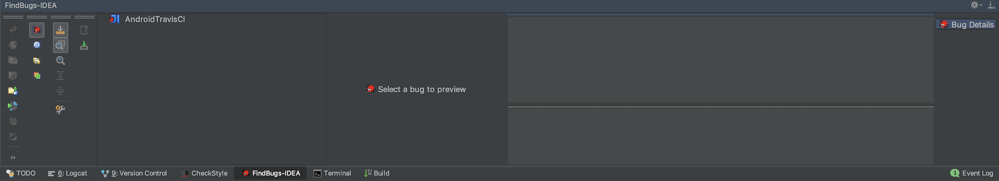
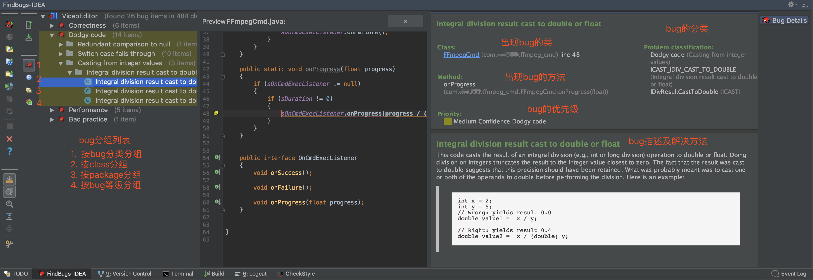

### 概述

>FindBugs 是一个静态分析工具，它检查类或者 JAR 文件，将字节码与一组缺陷模式进行对比以发现可能的问题。有了静态分析工具，就可以在不实际运行程序的情况对软件进行分析。不是通过分析类文件的形式或结构来确定程序的意图，而是通过使用 Visitor 模式。

<!--more-->

### FindBugs—代码缺陷分类

- `Bad practice`：不好的做法，代码违反了公认的最佳实践标准；
- `Malicious code vulnerability`：恶意的代码漏洞；
- `Correctness`：正确性；
- `Performance`：潜在的性能问题；
- `Security`：安全性；
- `Dodgy code`：糟糕的代码，FindBugs团队认为该类型下的问题代码导致bug的可能性很高；
- &nbsp;`Experimental`：实验；
- `Multithreaded correctness`：关注于同步和多线程问题；
- `Internationalization`：国际化。

### 安装插件




### 配置过滤文件

Step1：在项目根目录下创建`findbugs-exclude.xml`文件

```xml
<?xml version="1.0" encoding="UTF-8"?>
<FindBugsFilter>
    <!-- http://stackoverflow.com/questions/7568579/eclipsefindbugs-exclude-filter-files-doesnt-work -->
    <Match>
        <Or>
            <Class name="~.*\.R\$.*"/>
            <Class name="~.*\.Manifest\$.*"/>
        </Or>
    </Match>
</FindBugsFilter>
```

Step2：配置


### 检测代码

**检测入口**：

- FindBugs面板


- 菜单列表


**检测结果**：




### 参考链接

1. [FindBugs Official](http://findbugs.sourceforge.net/)
2. [FindBugs，第 1 部分: 提高代码质量](https://www.ibm.com/developerworks/cn/java/j-findbug1/index.html?mhq=findbugs&mhsrc=ibmsearch_a)
3. [FindBugs，第 2 部分: 编写自定义检测器](https://www.ibm.com/developerworks/cn/java/j-findbug2/index.html?mhq=findbugs&mhsrc=ibmsearch_a)
4. [代码缺陷扫描神器——FindBugs](https://www.jianshu.com/p/bc27857c89e4)
5. [AndroidStudio 插件 之 Findbugs 安装与简单使用教程](https://blog.csdn.net/u013132758/article/details/70187846)
6. [FindBugs 常见错误类型整理](https://zdran.com/20180717.html)
7. [FindBugs规则整理](https://blog.csdn.net/jdsjlzx/article/details/21472253)

