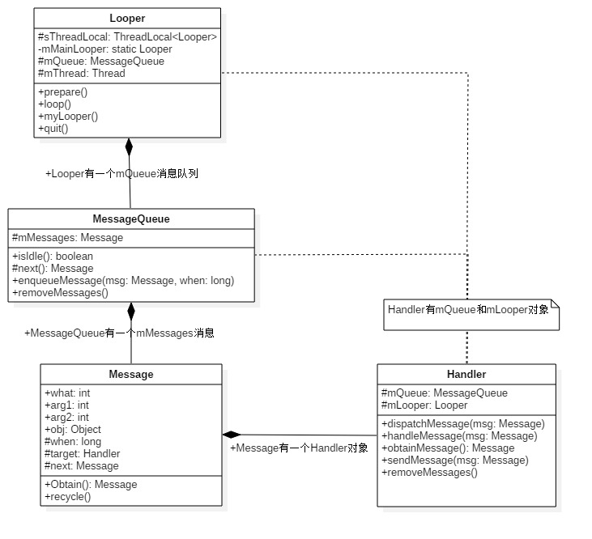
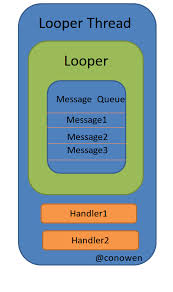
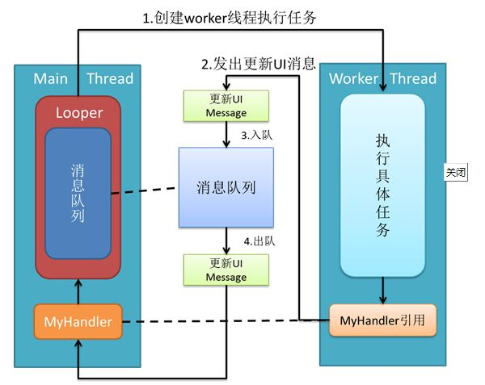
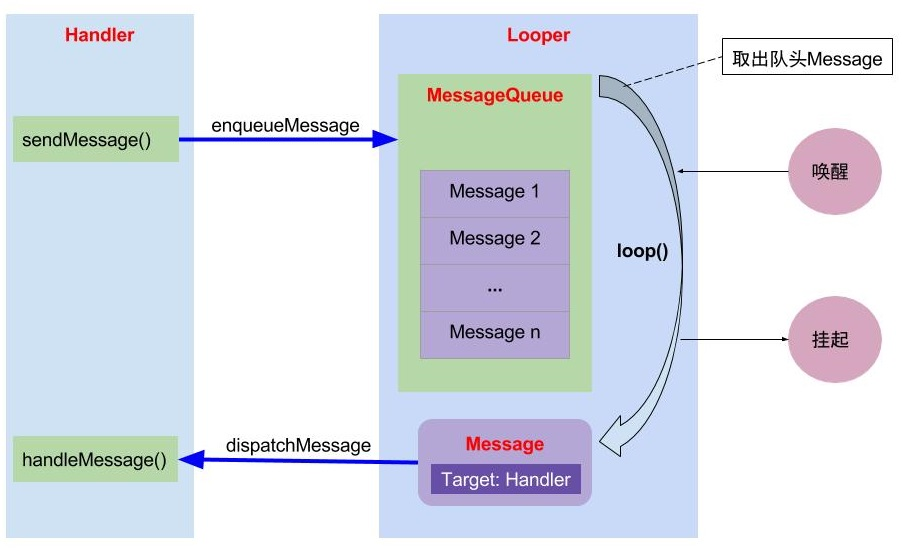

### 概述

>Handler是Android消息机制的上层接口。通过它可以轻松地将一个任务切换到Handler所在的线程中去执行。通常情况下，Handler的使用场景就是`更新UI`。

<!--more-->

### Handler的使用

> 在子线程中，进行耗时操作，执行完操作后，发送消息，通知主线程更新UI。

```java
public class Activity extends android.app.Activity {
    
    private Handler mHandler = new Handler(){
        @Override
        public void handleMessage(Message msg) {
            super.handleMessage(msg);
            
            // 更新UI
        }
    };
    
    @Override
    public void onCreate(Bundle savedInstanceState, PersistableBundle persistentState) {
        super.onCreate(savedInstanceState, persistentState);
        setContentView(R.layout.activity_main);
        
        new Thread(new Runnable() {
            @Override
            public void run() {
                // 执行耗时任务
                ...
                // 任务执行完后，通知Handler更新UI
                Message message = Message.obtain();
                message.what = 1;
                mHandler.sendMessage(message);
            }
        }).start();
    }
}
```

### Handler架构

> Handler消息机制主要包括：`MessageQueue`、`Handler`、`Looper`这三大部分，以及`Message`。
>
> **Message**：需要传递的消息，可以传递数据；
>
> **MessageQueue**：消息队列，但是它的内部实现并不是用的队列，而是通过单链表的数据结构来维护消息列表，因为单链表在插入和删除上比较有优势。主要功能是向消息池投递消息（`MessageQueue.enqueueMessage`）和取走消息池的消息（`MessageQueue.next`）。
>
> **Handler**：消息辅助类，主要功能是向消息池发送各种消息事件（`Handler.sendMessage`）和处理相应消息事件（`Handler.handleMessage`）；
>
> **Looper**：消息控制器，不断循环执行（`Looper.loop`），从MessageQueue中读取消息，按分发机制将消息分发给目标处理者。



从上面的类图可以看出：

- Looper有一个MessageQueue消息队列；
- MessageQueue有一组待处理的Message；
- Message中记录发送和处理消息的Handler；
- Handler中有Looper和MessageQueue。

> **MessageQueue、Handler和Looper三者之间的关系：**
>
> 每个线程中只能存在一个Looper，Looper是保存在ThreadLocal中的。
>
> 主线程（UI线程）已经创建了一个Looper，所以在主线程中不需要再创建Looper，但是在其他线程中需要创建Looper。
>
> 每个线程中可以有多个Handler，即一个Looper可以处理来自多个Handler的消息。
>
> Looper中维护一个MessageQueue，来维护消息队列，消息队列中的Message可以来自不同的Handler。




### Handler的运行流程

> 在子线程执行完耗时操作，当Handler发送消息时，将会调用`MessageQueue.enqueueMessage`，向消息队列中添加消息。
>
> 当通过`Looper.loop`开启循环后，会不断地从消息池中读取消息，即调用`MessageQueue.next`，
>
> 然后调用目标Handler（即发送该消息的Handler）的`dispatchMessage`方法传递消息，
>
> 然后返回到Handler所在线程，目标Handler收到消息，调用`handleMessage`方法，接收消息，处理消息。




### 源码分析

#### 在子线程创建Handler

```java
class LooperThread extends Thread {
      public Handler mHandler;

      public void run() {
          Looper.prepare();

          mHandler = new Handler() {
              public void handleMessage(Message msg) {
                  // process incoming messages here
              }
          };

          Looper.loop();
      }
  }
```

从上面可以看出，在子线程中创建Handler之前，要调用`Looper.prepare()`方法，Handler创建后，还要调用`Looper.loop()`方法。而前面我们在主线程创建Handler却不要这两个步骤，因为系统帮我们做了。

#### 主线程的Looper

> 在ActivityThread的main方法，会调用`Looper.prepareMainLooper()`来初始化Looper，并调用`Looper.loop()`方法来开启循环。

```java
public final class ActivityThread extends ClientTransactionHandler {
    
    // ...
    public static void main(String[] args) {
        
        // ...
        Looper.prepareMainLooper();
        
        // ...
        Looper.loop();
    }
    
}
```

#### Looper

> 从上可知，要使用Handler，必须先创建一个Looper。

**初始化Looper**：

```java
public final class Looper {
 
    public static void prepare() {
        prepare(true);
    }

    private static void prepare(boolean quitAllowed) {
        if (sThreadLocal.get() != null) {
            throw new RuntimeException("Only one Looper may be created per thread");
        }
        sThreadLocal.set(new Looper(quitAllowed));
    }

    public static void prepareMainLooper() {
        prepare(false);
        synchronized (Looper.class) {
            if (sMainLooper != null) {
                throw new IllegalStateException("The main Looper has already been prepared.");
            }
            sMainLooper = myLooper();
        }
    }
    
    
    private Looper(boolean quitAllowed) {
        mQueue = new MessageQueue(quitAllowed);
        mThread = Thread.currentThread();
    }
    
    // ...
}
```

从上可以看出，不能重复创建Looper，每个线程只能创建一个。创建Looper，并保存在`ThreadLocal`。其中ThreadLocal是线程本地存储区（Thread Local Storage，简称TLS），每个线程都有自己的私有的本地存储区域，不同线程之间彼此不能访问对方的TLS区域。

**开启Looper**

```java
public final class Looper {
    
    // ...
    public static void loop() {
    	// 获取TLS存储的Looper对象
        final Looper me = myLooper();
        if (me == null) {
            throw new RuntimeException("No Looper; Looper.prepare() wasn't called on this thread.");
        }
        final MessageQueue queue = me.mQueue;

        // 进入loop主循环方法
        for (;;) {
            Message msg = queue.next(); // 可能会阻塞，因为next()方法可能会无线循环
            if (msg == null) {
                // No message indicates that the message queue is quitting.
                return;
            }

            // This must be in a local variable, in case a UI event sets the logger
            final Printer logging = me.mLogging;
            if (logging != null) {
                logging.println(">>>>> Dispatching to " + msg.target + " " +
                        msg.callback + ": " + msg.what);
            }

            // ...
            final long dispatchStart = needStartTime ? SystemClock.uptimeMillis() : 0;
            final long dispatchEnd;
            try {
                // 获取msg的目标Handler，然后分发Message
                msg.target.dispatchMessage(msg);
                dispatchEnd = needEndTime ? SystemClock.uptimeMillis() : 0;
            } finally {
                if (traceTag != 0) {
                    Trace.traceEnd(traceTag);
                }
            }
            // ...

            msg.recycleUnchecked();
        }
    }
}
```

#### Handler

**创建Handler**：

```java
public class Handler {
    
    // ...
    public Handler() {
        this(null, false);
    }
    
    public Handler(Callback callback, boolean async) {
        // ...
		
        // 必须先执行Looper.prepare()，才能获取Looper对象，否则为null
        mLooper = Looper.myLooper();
        if (mLooper == null) {
            throw new RuntimeException(
                "Can't create handler inside thread " + Thread.currentThread()
                        + " that has not called Looper.prepare()");
        }
        mQueue = mLooper.mQueue;  // 消息队列，来自Looper对象
        mCallback = callback;     // 回调方法
        mAsynchronous = async;    // 设置消息是否为异步处理方式
    }
}
```

**发送消息**：

> 子线程通过Handler的post()方法或send()方法发送消息，最终都是调用`sendMessageAtTime()`方法。

post方法：

```java
public final boolean post(Runnable r)
{
    return sendMessageDelayed(getPostMessage(r), 0);
}

public final boolean postAtTime(Runnable r, long uptimeMillis)
{
    return sendMessageAtTime(getPostMessage(r), uptimeMillis);
}

public final boolean postAtTime(Runnable r, Object token, long uptimeMillis)
{
    return sendMessageAtTime(getPostMessage(r, token), uptimeMillis);
}

public final boolean postDelayed(Runnable r, long delayMillis)
{
    return sendMessageDelayed(getPostMessage(r), delayMillis);
}

private static Message getPostMessage(Runnable r) {
    Message m = Message.obtain();
    m.callback = r;
    return m;
}
```

send方法：

```java
public final boolean sendMessage(Message msg)
{
    return sendMessageDelayed(msg, 0);
}

public final boolean sendEmptyMessage(int what)
{
    return sendEmptyMessageDelayed(what, 0);
}

public final boolean sendEmptyMessageDelayed(int what, long delayMillis) {
    Message msg = Message.obtain();
    msg.what = what;
    return sendMessageDelayed(msg, delayMillis);
}

public final boolean sendEmptyMessageAtTime(int what, long uptimeMillis) {
    Message msg = Message.obtain();
    msg.what = what;
    return sendMessageAtTime(msg, uptimeMillis);
}

public final boolean sendMessageDelayed(Message msg, long delayMillis)
{
    if (delayMillis < 0) {
        delayMillis = 0;
    }
    return sendMessageAtTime(msg, SystemClock.uptimeMillis() + delayMillis);
}
```

`sendMessageAtTime()`

```java
public boolean sendMessageAtTime(Message msg, long uptimeMillis) {
    MessageQueue queue = mQueue;
    if (queue == null) {
        RuntimeException e = new RuntimeException(
            this + " sendMessageAtTime() called with no mQueue");
        Log.w("Looper", e.getMessage(), e);
        return false;
    }
    return enqueueMessage(queue, msg, uptimeMillis);
}

private boolean enqueueMessage(MessageQueue queue, Message msg, long uptimeMillis) {
    msg.target = this;
    if (mAsynchronous) {
        msg.setAsynchronous(true);
    }
    return queue.enqueueMessage(msg, uptimeMillis);
}
```

#### 分发消息

> 在loop()方法中，获取到下一条消息后，执行`msg.target.dispatchMessage(msg)`，来分发消息到目标Handler。

```java
public class Handler {
    
    // ...
    public void dispatchMessage(Message msg) {
        if (msg.callback != null) {
            // 当Message存在回调方法，调用该回调方法
            handleCallback(msg);
        } else {
            if (mCallback != null) {
                // 当Handler存在Callback成员变量时，回调其handleMessage()方法
                if (mCallback.handleMessage(msg)) {
                    return;
                }
            }
            // Handler自身的回调方法
            handleMessage(msg);
        }
    }
    
    private static void handleCallback(Message message) {
        message.callback.run();
    }
}
```

### 总结




### 参考链接

1. [Handler](https://developer.android.com/reference/android/os/Handler)
2. [Communicate with the UI thread](https://developer.android.com/training/multiple-threads/communicate-ui)
3. [Android消息机制](https://lrh1993.gitbooks.io/android_interview_guide/content/android/basis/message-mechanism.html)
4. [一文看穿 Handler](http://yifeiyuan.me/blog/f77487d3.html)
5. [Android应用程序消息处理机制（Looper、Handler）分析](https://blog.csdn.net/luoshengyang/article/details/6817933)
6. [Android消息机制1-Handler(Java层)](http://gityuan.com/2015/12/26/handler-message-framework/)
7. [进程和线程](https://developer.android.com/guide/components/processes-and-threads.html)