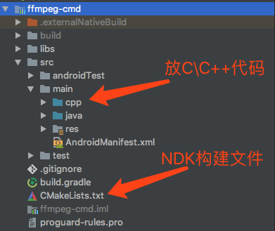
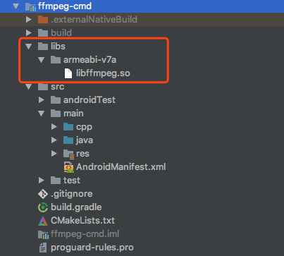
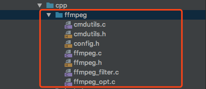

### 概述

>FFmpeg，命令行非常强大。在PC机上，调用一行FFmpeg命令，就可以对视频文件进行剪切、合并、转码等功能。本文将介绍如何在Android中调用FFmpeg命令行。
>

<!--more-->

### 编译

>前面已经有两篇文章介绍FFmpeg的编译：
>
>1. [Android NDK交叉编译FFmpeg](https://xch168.github.io/2018/07/22/android-ndk-ffmpeg-compile/)
>2. [将FFmpeg编译成一个libffmpeg.so库](https://xch168.github.io/2018/08/04/android-ndk-compile-ffmpeg-to-a-so/)

### 创建ffmpeg-cmd模块

#### Step1：目录结构



#### Step2：导入libffmpeg.so库



在`ffmpeg-cmd`模块的`build.gradle`中添加配置：

```groovy
android {
    
    // 省略其他配置...
    defaultConfig {
        // 省略其他配置...
        
        // 配置cmake构建参数
        externalNativeBuild {
            cmake {
                cppFlags ""
                abiFilters 'armeabi-v7a'
            }
        }
    }

    // 配置cmake构建脚本的路径
    externalNativeBuild {
        cmake {
            path "CMakeLists.txt"
        }
    }

    // 定义jniLib的目录到libs
    sourceSets.main {
        jniLibs.srcDirs = ['libs']
    }
}
```

#### Step3：导入FFmpeg的相关头文件


#### Step4: 导入FFmpeg的相关源码文件

> 在源码目录的`fftools`文件夹内



#### Step5:  编写CMakeLists.txt文件

```cmake
cmake_minimum_required(VERSION 3.4.1)

set(CMAKE_CXX_FLAGS "${CMAKE_CXX_FLAGS} -std=gnu++11")

# 添加头文件路径
include_directories(
        ./src/main/cpp
        ./src/main/cpp/ffmpeg
        ./src/main/cpp/include
)

# 定义源码所在目录
aux_source_directory(./src/main/cpp SRC)
aux_source_directory(./src/main/cpp/ffmpeg SRC_FFMPEG)

# 将 SRC_FFMPEG 添加到 SRC 中
list(APPEND SRC ${SRC_FFMPEG})

# 设置ffmpeg库所在路径的目录
set(distribution_DIR ${CMAKE_SOURCE_DIR}/libs/${ANDROID_ABI})

# 编译一个ffmpeg-cmd库
add_library(  ffmpeg-cmd   # 库名称
        SHARED             # 库类型
        ${SRC})            # 编译进库的源码

# 添加libffmpeg.so库
add_library( ffmpeg
        SHARED
        IMPORTED )
# 指定libffmpeg.so库的位置
set_target_properties( ffmpeg
        PROPERTIES IMPORTED_LOCATION
        ${distribution_DIR}/libffmpeg.so )

# 查找日志库
find_library(
        log-lib
        log )

# 将其他库链接到目标库ffmpeg-cmd
target_link_libraries( ffmpeg-cmd
        ffmpeg
        -landroid     # native_window
        -ljnigraphics # bitmap
        -lOpenSLES    # openSLES
        ${log-lib} )
```

### 修改FFmpeg源码

- ffmpeg.c

  修改main方法：

  ```c
  // 修改前
  int main(int argc, char **argv)
  
  // 修改后
  int ffmpeg_exec(int argc, char **argv)
  ```

  在`ffmpeg_cleanup`函数执行结束前重新初始化：

  ```c
  static void ffmpeg_cleanup(int ret) {
  	
      // 省略其他代码...
      
      nb_filtergraphs = 0;
      nb_output_files = 0;
      nb_output_streams = 0;
      nb_input_files = 0;
      nb_input_streams = 0;
  }
  ```

  在`print_report`函数中添加代码实现FFmpeg命令执行进度的回调：

  ```c
  static void print_report(int is_last_report, int64_t timer_start, int64_t cur_time) {
      
      // 省略其他代码...
      
      // 定义已处理的时长
      float mss;
      
      secs = FFABS(pts) / AV_TIME_BASE;
      us = FFABS(pts) % AV_TIME_BASE;
      // 获取已处理的时长
      mss = secs + ((float) us / AV_TIME_BASE);
      
      // 调用ffmpeg_progress将进度传到Java层，代码后面定义
      ffmpeg_progress(mss);
      
      // 省略其他代码...
  }
  ```

- ffmpeg.h

  添加`ffmpeg_exec`方法的声明：

  ```c
  int ffmpeg_exec(int argc, char **argv);
  ```

- cmdutils.c

  修改`exit_program`函数：

  ```c
  void exit_program(int ret) {
      if (program_exit)
          program_exit(ret);
  
      // 退出线程(该函数后面定义)
      ffmpeg_thread_exit(ret);
  
      // 删掉下面这行代码，不然执行结束，应用会crash
      //exit(ret);
  }
  ```

### 编写JNI调用FFmpeg命令

**Note**：这部分代码来自开源库 [EpMedia](https://xch168.github.io/2018/08/04/android-ndk-compile-ffmpeg-to-a-so/)

#### C代码：

ffmpeg_cmd.h

```c
#include <jni.h>

#ifndef _Included_FFmpeg_Cmd
#define _Included_FFmpeg_Cmd
#ifdef __cplusplus
extern "C" {
#endif

JNIEXPORT jint JNICALL Java_com_github_xch168_ffmpeg_1cmd_FFmpegCmd_exec(JNIEnv *, jclass, jint, jobjectArray);

JNIEXPORT void JNICALL Java_com_github_xch168_ffmpeg_1cmd_FFmpegCmd_exit(JNIEnv *, jclass);

#ifdef __cplusplus
}
#endif
#endif

void ffmpeg_progress(float progress);
```

ffmpeg_cmd.c

```c
#include "ffmpeg_cmd.h"

#include <jni.h>
#include <string.h>
#include "ffmpeg_thread.h"
#include "android_log.h"
#include "cmdutils.h"

static JavaVM *jvm = NULL;
//java虚拟机
static jclass m_clazz = NULL;//当前类(面向java)

/**
 * 回调执行Java方法
 * 参看 Jni反射+Java反射
 */
void callJavaMethod(JNIEnv *env, jclass clazz,int ret) {
    if (clazz == NULL) {
        LOGE("---------------clazz isNULL---------------");
        return;
    }
    //获取方法ID (I)V指的是方法签名 通过javap -s -public FFmpegCmd 命令生成
    jmethodID methodID = (*env)->GetStaticMethodID(env, clazz, "onExecuted", "(I)V");
    if (methodID == NULL) {
        LOGE("---------------methodID isNULL---------------");
        return;
    }
    //调用该java方法
    (*env)->CallStaticVoidMethod(env, clazz, methodID,ret);
}
void callJavaMethodProgress(JNIEnv *env, jclass clazz,float ret) {
    if (clazz == NULL) {
        LOGE("---------------clazz isNULL---------------");
        return;
    }
    //获取方法ID (I)V指的是方法签名 通过javap -s -public FFmpegCmd 命令生成
    jmethodID methodID = (*env)->GetStaticMethodID(env, clazz, "onProgress", "(F)V");
    if (methodID == NULL) {
        LOGE("---------------methodID isNULL---------------");
        return;
    }
    //调用该java方法
    (*env)->CallStaticVoidMethod(env, clazz, methodID,ret);
}

/**
 * c语言-线程回调
 */
static void ffmpeg_callback(int ret) {
    JNIEnv *env;
    //附加到当前线程从JVM中取出JNIEnv, C/C++从子线程中直接回到Java里的方法时  必须经过这个步骤
    (*jvm)->AttachCurrentThread(jvm, (void **) &env, NULL);
    callJavaMethod(env, m_clazz,ret);

    //完毕-脱离当前线程
    (*jvm)->DetachCurrentThread(jvm);
}

void ffmpeg_progress(float progress) {
    JNIEnv *env;
    (*jvm)->AttachCurrentThread(jvm, (void **) &env, NULL);
    callJavaMethodProgress(env, m_clazz,progress);
    (*jvm)->DetachCurrentThread(jvm);
}

JNIEXPORT jint JNICALL
Java_com_github_xch168_ffmpeg_1cmd_FFmpegCmd_exec(JNIEnv *env, jclass clazz, jint cmdnum, jobjectArray cmdline) {
    (*env)->GetJavaVM(env, &jvm);
    m_clazz = (*env)->NewGlobalRef(env, clazz);
    //---------------------------------C语言 反射Java 相关----------------------------------------
    //---------------------------------java 数组转C语言数组----------------------------------------
    int i = 0;//满足NDK所需的C99标准
    char **argv = NULL;//命令集 二维指针
    jstring *strr = NULL;

    if (cmdline != NULL) {
        argv = (char **) malloc(sizeof(char *) * cmdnum);
        strr = (jstring *) malloc(sizeof(jstring) * cmdnum);

        for (i = 0; i < cmdnum; ++i) {//转换
            strr[i] = (jstring)(*env)->GetObjectArrayElement(env, cmdline, i);
            argv[i] = (char *) (*env)->GetStringUTFChars(env, strr[i], 0);
        }

    }
    //---------------------------------java 数组转C语言数组----------------------------------------
    //---------------------------------执行FFmpeg命令相关----------------------------------------
    //新建线程 执行ffmpeg 命令
    ffmpeg_thread_run_cmd(cmdnum, argv);
    //注册ffmpeg命令执行完毕时的回调
    ffmpeg_thread_callback(ffmpeg_callback);

    free(strr);
    return 0;
}

JNIEXPORT void JNICALL
Java_com_github_xch168_ffmpeg_1cmd_FFmpegCmd_exit(JNIEnv *env, jclass type) {
    (*env)->GetJavaVM(env, &jvm);
    m_clazz = (*env)->NewGlobalRef(env, type);
    ffmpeg_thread_cancel();

}
```

ffmpeg_thread.h

```c
#include "libavcodec/avcodec.h"
#include "libavformat/avformat.h"
#include "libswscale/swscale.h"
#include "ffmpeg.h"
#include <pthread.h>
#include <string.h>

int ffmpeg_thread_run_cmd(int cmdnum,char **argv);

void ffmpeg_thread_exit(int ret);

void ffmpeg_thread_callback(void (*cb)(int ret));

void ffmpeg_thread_cancel();
```

ffmpeg_thread.c

```c
#include "libavcodec/avcodec.h"
#include "ffmpeg_thread.h"
#include "android_log.h"

pthread_t ntid;
char **argvs = NULL;
int num=0;

void *thread(void *arg) {   //执行
    int result = ffmpeg_exec(num, argvs);
    ffmpeg_thread_exit(result);
    return ((void *)0);
}
/**
 * 新建子线程执行ffmpeg命令
 */
int ffmpeg_thread_run_cmd(int cmdnum,char **argv) {
    num=cmdnum;
    argvs=argv;

    int temp =pthread_create(&ntid,NULL,thread,NULL);
    if(temp!=0) {
        LOGE("can't create thread: %s ",strerror(temp));
        return 1;
    }
    LOGI("create thread succes: %s ",strerror(temp));
    return 0;
}

static void (*ffmpeg_callback)(int ret);

/**
 * 注册线程回调
 */
void ffmpeg_thread_callback(void (*cb)(int ret)) {
    ffmpeg_callback = cb;
}

/**
 * 退出线程
 */
void ffmpeg_thread_exit(int ret) {
    if (ffmpeg_callback) {
        ffmpeg_callback(ret);
    }
    pthread_exit("ffmpeg_thread_exit");
}

/**
 * 取消线程
 */
void ffmpeg_thread_cancel() {
    void *ret=NULL;
    pthread_join(ntid, &ret);
}

```

#### Java代码：

FFmpegCmd.java

```java
public class FFmpegCmd
{
    static
    {
        System.loadLibrary("ffmpeg-cmd");
    }

    private static OnCmdExecListener sOnCmdExecListener;
    private static long sDuration;

    public static native int exec(int argc, String[] argv);

    public static native void exit();

    public static void exec(String[] cmds, long duration, OnCmdExecListener listener) {
        sOnCmdExecListener = listener;
        sDuration = duration;

        exec(cmds.length, cmds);
    }

    /**
     * FFmpeg执行结束回调，由C代码中调用
     */
    public static void onExecuted(int ret) {
        if (sOnCmdExecListener != null) {
            if (ret == 0) {
                sOnCmdExecListener.onProgress(sDuration);
                sOnCmdExecListener.onSuccess();
            } else {
                sOnCmdExecListener.onFailure();
            }
        }
    }

    /**
     * FFmpeg执行进度回调，由C代码调用
     */
    public static void onProgress(float progress) {
        if (sOnCmdExecListener != null) {
            if (sDuration != 0) {
                sOnCmdExecListener.onProgress(progress / (sDuration / 1000) * 0.95f);
            }
        }
    }

    public interface OnCmdExecListener {
        void onSuccess();

        void onFailure();

        void onProgress(float progress);
    }
}
```

FFmpegUtil.java

```java
// 封装FFmpeg命令的调用
public class FFmpegUtil {
    private static final String TAG = "FFmpegUtil";

    public static void execCmd(CmdList cmd, long duration, final OnVideoProcessListener listener) {
        String[] cmds = cmd.toArray(new String[cmd.size()]);
        Log.i(TAG, "cmd:" + cmd);
        listener.onProcessStart();
        FFmpegCmd.exec(cmds, duration, new FFmpegCmd.OnCmdExecListener() {
            @Override
            public void onSuccess() {
                listener.onProcessSuccess();
            }

            @Override
            public void onFailure() {
                listener.onProcessFailure();
            }

            @Override
            public void onProgress(float progress) {
                listener.onProcessProgress(progress);
            }
        });
    }
}
```

CmdList.java

```java
public class CmdList extends ArrayList<String> {
    public CmdList append(String s) {
        this.add(s);
        return this;
    }

    public CmdList append(int i) {
        this.add(i + "");
        return this;
    }

    public CmdList append(float f) {
        this.add(f + "");
        return this;
    }

    public CmdList append(StringBuilder sb) {
        this.add(sb.toString());
        return this;
    }

    public CmdList append(String[] ss) {
        for (String s:ss) {
            if(!s.replace(" ","").equals("")) {
                this.add(s);
            }
        }
        return this;
    }

    @Override
    public String toString() {
        StringBuilder sb = new StringBuilder();
        for (String s : this) {
            sb.append(" ").append(s);
        }
        return sb.toString();
    }
}
```

### 调用FFmpeg命令

```java
long duration = endTime - startTime;
// 构建一条视频裁剪命令
CmdList cmd = new CmdList();
cmd.append("ffmpeg");
cmd.append("-y");
cmd.append("-ss").append(startTime/ 1000).append("-t").append(duration / 1000).append("-accurate_seek");
cmd.append("-i").append(srcFile);
cmd.append("-codec").append("copy").append(destFile);

FFmpegUtil.execCmd(cmd, duration, new OnVideoProcessListener() {
    @Override
    public void onProcessStart() {}

    @Override
    public void onProcessProgress(float progress) {}

    @Override
    public void onProcessSuccess() {}

    @Override
    public void onProcessFailure() {}
}
```

源码地址：https://github.com/xch168/VideoEditor

### 参考链接

1. [ 将FFmpeg移植到Android平台](https://www.jianshu.com/p/3479bba0cf28)
2. [EpMedia](https://github.com/yangjie10930/EpMedia)
3. [FFmpegAndroid](https://github.com/xufuji456/FFmpegAndroid)