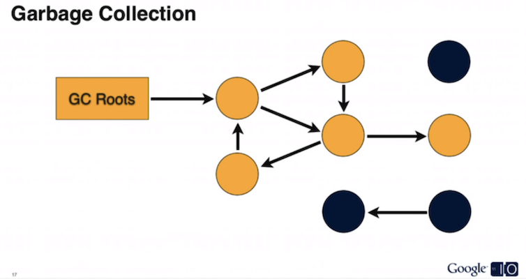

### 概述

>内存泄漏，即Memory Leak，指程序中不再使用到的对象因某种原因而无法被GC正常回收。发生内存泄漏，会导致一些不再使用到的对象没有及时释放，这些对象占据着宝贵的内存空间，很容易导致后续分配内存的时候，内存空间不足而出现OOM（内存溢出）。无用对象占据的空间越多，那么可用的空闲空间也就越少，GC就会更容易被触发，GC进行时会停止其他线程的工作，因此有可能造成卡顿等情况。

<!--more-->

### Java内存分配策略

> Java程序运行时的内存分配策略有三种，分别是`静态分配`、`栈式分配`和`堆分配`，对应的，三种存储策略使用的内存空间主要分别是`静态存储区（也称方法区）`、`栈区`和`堆区`。

- 静态存储区（方法区）：主要存放`静态数据`、`全局static数据`和`常量`。这块内存在程序编译时就已经分配好，并且在程序整个运行期间都存在。
- 栈区：当方法被执行时，方法体内的局部变量都在栈上创建，并在方法执行结束时这些局部变量所持有的内存将会自动被释放。
- 堆区：又称动态内存分配，通常就是指在程序运行时直接new出来的内存。这部分内存在不使用时将会由Java垃圾回收器来负责回收。

```java
public class Sample {
    
    int s1 = 0;
    Sample mSample1 = new Sample();

    public void method() {
        int s2 = 1;
        Sample mSample2 = new Sample();
    }
}

Sample mSample3 = new Sample();
```

**说明**：

- 局部变量s2和引用变量mSample2都位于栈中，但是mSample2指向的对象是存在于堆上的；
- mSample3保存于栈中，而其指向的对象实体存放在堆上，包括这个对象的所有成员变量s1和mSample1。

### Java是如何管理内存

> Java的内存管理就是对象的分配和释放问题。在Java中，通过关键字`new`为每个对象申请内存空间，所有的对象都在堆（Heap）中分配空间，对象的释放是由GC决定和执行的。

> GC(Garbage Collection) 即垃圾回收机制，在Java虚拟机上运行的一个程序，它会监控对象的使用，将不再使用的对象释放，回收内存。

**Java判断对象是否可以回收使用的是`可达性分析`算法。**

>可达性分析算法：通过一系列被称为“`GC Roots`”的对象作为起点，从这些节点开始向下搜索，搜索所走过的路径称为引用链，当一个对象到GC Roots没有任何引用链相连时（就是从GC Roots到这个对象是不可达），则证明此对象是不可用的，所以它们会被判断为可回收对象。（如下图黑色的圆圈）

在Java语言中，可以作为GC Roots的对象有如下几种：

- 虚拟机栈（栈帧中的本地变量表）中引用的对象；
- 方法区中类静态属性引用的对象；
- 方法区中常量引用的对象；
- 本地方法栈中JNI（Native方法）引用的对象。




### Java中的引用

> 在Java中，将引用方式分为：`强引用`、`软引用`、`弱引用`、`虚引用`，这四种引用强度依次逐渐减弱。

**强引用**：类似“Object obj = new Object()”这类的引用，只要强引用还存在，垃圾收集器永远不会回收掉被引用的对象。

**软引用**：用来描述一些还有用但并非必须的对象。在系统将要发生内存溢出之前，将会把这些对象列进回收范围之中进行第二次回收。

**弱引用**：用户描述非必须对象的。被弱引用关联的对象只能生存到下一次垃圾收集发生之前。当垃圾收集器工作时，无论当前内存是否足够，都会回收掉只被弱引用关联的对象。

**虚引用**：一个对象是否有虚引用存在，完全不会对其生存时间构成影响，也无法通过虚引用来取得一个对象实例。为一个对象设置虚引用的唯一目的就是能在这个对象被收集器回收时刻得到一个系统通知。

### 内存泄漏的场景

#### 静态变量内存泄漏

>静态变量的生命周期跟整个程序的生命周期一致。只要静态变量没有被销毁也没有置为null，其对象就一直被保持引用，也就不会被垃圾回收，从而出现内存泄漏。

```java
// MainActivity.java
public class MainActivity extends AppCompatActivity {

    private static Test sTest;

    @Override
    protected void onCreate(Bundle savedInstanceState) {
        super.onCreate(savedInstanceState);
        setContentView(R.layout.activity_main);

        sTest = new Test(this);
    }
}

// Test.java
public class Test {
    private Context context;

    public Test(Context context) {
        this.context = context;
    }
}
```

**说明：**sTest作为静态变量，并且持有Activity的引用，sTest的生命周期肯定比Activity的生命周期长。因此当Activity退出后，由于Activity仍被sTest引用到，所以Activity就不能被回收，造成了内存泄漏。

**Activity这种占用内存非常多的对象，内存泄漏的话影响非常大。**

**解决方案**：

- **针对静态变量**

  > 在不使用静态变量时置为空，如：

  ```java
  sTest = null;
  ```

- **针对Context**

  > 如果用到Context，尽量去使用Application的Context，避免直接传递Activity，如：

  ```java
  sTest = new Test(getApplicationContext());
  ```

- **针对Activity**

  > 若一定要使用Activity，建议使用弱引用或软引用来代替强引用。如：

  ```java
  // 弱引用
  WeakReference<Activity> weakReference = new WeakReference<>(this);
  Activity activity = weakReference.get();
  
  // 软引用
  SoftReference<Activity> softReference = new SoftReference<>(this);
  Activity activity = softReference.get();
  ```

#### 单例内存泄漏

> 单例模式其生命周期跟应用一样，所以使用单例模式时传入的参数需要注意一下，避免传入Activity等对象造成内存泄漏。

```java
public class AppManager {
    private static AppManager instance;
    private Context context;

    private AppManager(Context context) {
        this.context = context;
    }

    public static AppManager getInstance(Context context) {
        if (instance == null) {
            instance = new AppManager(context);
        }
        return instance;
    }
}
```

**说明**：当创建这个单例对象的使用，由于需要传入一个Context，所以这个Context的生命周期的长短至关重要；

- 如果传入的是Application的Context，因为Application的生命周期就是整个应用的生命周期，所以这将没有任何问题。
- 如果传入的是Activity的Context，当这个Context所对应的Activity退出时，由于该Context的引用被单例所持有，其生命周期等于整个应用程序的生命周期，所以当前Activity退出时它的内存并不会被回收，这就造成泄漏了。

**解决方案**：

> 使用和单例生命周期一样的对象。

```java
public class AppManager {
    private static AppManager instance;
    private Context context;

    private AppManager(Context context) {
        this.context = context.getApplicationContext(); // 使用Application的context
    }

    public static AppManager getInstance(Context context) {
        if (instance == null) {
            instance = new AppManager(context);
        }
        return instance;
    }
}
```


#### 非静态内部类（匿名类）内存泄漏

>非静态内部类（匿名类）默认就持有外部类的引用，当非静态内部类（匿名类）对象的生命周期比外部类对象的生命周期长时，就会导致内存泄漏。

##### Handler内存泄漏

> 如果Handler中有`延迟任务`或者`等待执行的任务队列过长`，都有可能因为Handler继续执行而导致Activity发生泄漏。

> 1. 首先，非静态的Handler类会默认持有外部类的引用，如Activity等。
>
> 2. 然后，还未处理完的消息（Message）中会持有Handler的引用。
>
> 3. 还未处理完的消息会处于消息队列中，即消息队列MessageQueue会持有Message的引用。
>
> 4. 消息队列MessageQueue位于Looper中，Looper的生命周期跟应用一致。

> **引用链**：Looper  -> MessageQueue -> Message -> Handler -> Activity

**解决方法**：

- 静态内部类+弱引用

  > 静态内部类默认不持有外部类的引用，所以改成静态内部类即可。同时，可以采用弱引用来持有Activity的引用。

  ```java
  private static class MyHandler extends Handler {
  
      private WeakReference<Activity> mWeakReference;
  
      public MyHandler(Activity activity) {
          mWeakReference = new WeakReference<>(activity);
      }
  
      @Override
      public void handleMessage(Message msg) {
          super.handleMessage(msg);
          //...
      }
  }
  ```

- Activity退出时，移除所有信息

  > 移除信息后，Handler将会跟Activity生命周期同步。

  ```java
  @Override
  protected void onDestroy() {
      super.onDestroy();
  
      mHandler.removeCallbacksAndMessages(null);
  }
  ```

  

##### 多线程引起的内存泄漏

> 匿名Thread类里持有外部类的引用。当Activity退出时，Thread有可能还在后头执行，这时就会发生内存泄露。

```java
new Thread(new Runnable() {
    @Override
    public void run() {

    }
}).start();
```

**解决方法**：

- 静态内部类

  > 静态内部类不持有外部类的引用。

  ```java
  private static class MyThread extends Thread {
      // ...
  }
  ```

- Activity退出时，结束线程

  > 这是让线程的生命周期跟Activity一致。

#### 集合类内存泄漏

> 集合类添加元素后，将会持有元素对象的引用，导致该元素对象不能被垃圾回收，从而发生内存泄漏。

```java
List<Object> objectList = new ArrayList<>();
for (int i = 0; i < 10; i++) {
    Object obj = new Object();
    objectList.add(obj);
    obj = null;
}
```

**说明**：虽然obj已经被置为空了，但是集合里还是持有Object的引用。

**解决方法**：

- 清空集合对象

  ```java
  objectList.clear();
  objectList = null;
  ```

  

#### 未关闭资源对象内存泄漏

>一些资源对象需要在不使用的时候主动去关闭或者注销掉，否则的话，他们不会被垃圾回收，从而造成内存泄漏。

##### 注销监听器

>当我们需要使用系统服务时，比如执行某些后台任务、为硬件访问提供接口等等系统服务。我们需要将自己注册到服务的监听器中，然而，这会让服务持有Activity的引用，如果忘记Activity销毁时取消注册，就会导致Activity泄露。

```java
unregisterXxx(xxx);
```

##### 关闭输入输出流

> 在使用IO、File流等资源时要及时关闭。这些资源在进行读写操作时通常都使用了缓冲，如果不及时关闭，这些缓冲对象就会一直被占用而得不到释放，以致发生内存泄露。

```java
inputStream.close();
outputStream.close();
```

##### 回收Bitmap

> Bitmap对象比较占内存，当它不再被使用的时候，最好调用`Bitmap.recycle()`方法主动进行回收。

```java
bitmap.recycle();
bitmap = null;
```

##### 停止动画

> 属性动画中有一类无限动画，如果Activity退出时不停止动画的话，动画会一直执行下去。因为动画会持有View的引用，View又持有Activity，最终Activity就不能被回收掉。只要我们在Activity退出把动画停止掉即可。

```java
animation.cancel();
```

##### 销毁WebView

> WebView在加载网页后会长期占用内存而不能被释放，因此在Activity销毁后要调用它的`destory()`方法来销毁它以释放内存。此外，WebView在Android 5.1上也会出现其他的内存泄露。

```java
@Override
protected void onDestroy() {
    if( mWebView!=null) {
        ViewParent parent = mWebView.getParent();
        if (parent != null) {
            ((ViewGroup) parent).removeView(mWebView);
        }

        mWebView.stopLoading();
        // 退出时调用此方法，移除绑定的服务，否则某些特定系统会报错
        mWebView.getSettings().setJavaScriptEnabled(false);
        mWebView.clearHistory();
        mWebView.clearView();
        mWebView.removeAllViews();
        mWebView.destroy();

    }
    super.onDestroy();
}
```


### 内存分析工具

#### dumpsys

> dumpsys命令可以查看内存使用情况。

```bash
adb shell dumpsys meminfo <packageName>
```


#### Memory Monitor


#### MAT


#### LeakCanary


### 参考链接

1. [循序渐进学用MAT排查Android Activity内存泄露](https://blog.csdn.net/u012735483/article/details/52434858)
2. [Android 内存泄露分析实战演练](https://mp.weixin.qq.com/s/_s88Xjti0YwO4rayKvF5Dg)
3. [ Android 内存泄漏总结](https://lrh1993.gitbooks.io/android_interview_guide/content/android/advance/memory-leak.html)
4. [微信 Android 终端内存优化实践](https://mp.weixin.qq.com/s/KtGfi5th-4YHOZsEmTOsjg)
5. [Android内存泄漏查找和解决](https://blog.csdn.net/xyq046463/article/details/51769728)
6. [Leakcanary检测内存泄漏汇总](https://www.jianshu.com/p/c345f63ec8e5)
7. [Java内存分配机制及内存泄漏](https://www.jianshu.com/p/85f49e1ff813)
8. [彻底搞懂Java内存泄露](https://www.jianshu.com/p/efec4c77e265)
9. [Android Studio和MAT结合使用来分析内存问题](https://mp.weixin.qq.com/s/ZkOxuM95GCD0g0NL14xmJw)
10. [Android内存申请分析](https://mp.weixin.qq.com/s/b_lFfL1mDrNVKj_VAcA2ZA)
11. [Android中导致内存泄漏的竟然是它----Dialog](https://mp.weixin.qq.com/s/sVbdugv-boumZ-oNk_92qg)
12. [记一次Activity的内存泄漏和分析过程](https://www.jianshu.com/p/2823e17cf9b5)
13. [实践App内存优化：如何有序地做内存分析与优化](https://juejin.im/post/5b1b5e29f265da6e01174b84)
14. [Android内存分析命令](http://gityuan.com/2016/01/02/memory-analysis-command/)
15. [JVM怎么判断对象是否已死？](https://lrh1993.gitbooks.io/android_interview_guide/content/java/virtual-machine/life-cycle.html)