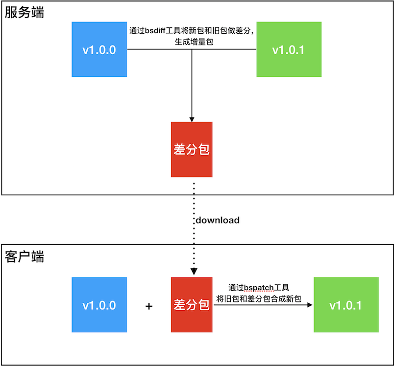
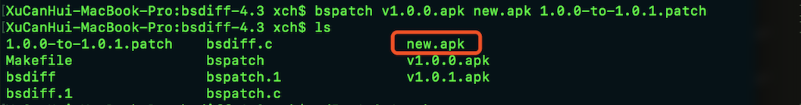
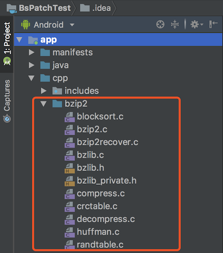

### 概述

> 现在的APP更新频率非常高，apk的大小也在不断的变大。如果每次新版本的更新，都让用户去下载一个完整的apk，这对于用户的耐心和流量都是巨大的消耗。特别是做应用市场的，如果没有增量更新，那么就要额外的付出高额的流量费用。

<!--more-->

### 原理

> 将手机已安装的apk与服务端最新的apk进行二进制对比，得到差分包，用户更新程序时，只需要下载差分包，并在本地使用差分包与已安装的apk合并成新版的apk。



### 工具

- bsdiff、bspatch

  下载地址：http://www.daemonology.net/bsdiff/

  编译源码：

  Step1: make

  出错信息：

  

  Step2: 修改`Makefile`文件，将install：下面的`if`和`endif`各添加一个缩进：

  ```makefile
  CFLAGS		+=	-O3 -lbz2
  
  PREFIX		?=	/usr/local
  INSTALL_PROGRAM	?=	${INSTALL} -c -s -m 555
  INSTALL_MAN	?=	${INSTALL} -c -m 444
  
  all:		bsdiff bspatch
  bsdiff:		bsdiff.c
  bspatch:	bspatch.c
  
  install:
  	${INSTALL_PROGRAM} bsdiff bspatch ${PREFIX}/bin
  	.ifndef WITHOUT_MAN
  	${INSTALL_MAN} bsdiff.1 bspatch.1 ${PREFIX}/man/man1
  	.endif
  ```

  Step3: make

  错误信息：

  

  Step4: 在bspath.c中添加`#include <sys/types.h>`

  Step5: make

  

### 生成差分包

```shell
./bsdiff v1.0.0.apk v1.0.1.apk 1.0.0-to-1.0.1.patch 
```


### 合并差分包

```shell
./bspatch v1.0.0.apk new.apk 1.0.0-to-1.0.1.patch
```



对比文件是否一样：


### 在Android项目中使用bspatch

Step1：下载依赖库`bzip`的源码（官网域名过期），可以从我的GitHub项目中拷贝：

下载地址：https://github.com/xch168/BsPatchTest

Step2：将bzip库，导入到Android项目中；



Step3：将bsdiff中的`bspatch.c`文件导入到Android项目中，并将bspatch.c中的`#include <bzlib.h>`改成`#include "bzip2/bzlib.h"`


Step4：编写CMakeLists.txt

```cmake
cmake_minimum_required(VERSION 3.4.1)

# 将./src/main/cpp目录（不包含子目录）下所有源文件保存在变量 SRC 中
aux_source_directory(./src/main/cpp SRC)
# 将./src/main/cpp/bzip2目录（不包含子目录）下所有源文件保存在变量 SRC_BZIP 中
aux_source_directory(./src/main/cpp/bzip2 SRC_BZIP)

# 将 SRC_BZIP 添加到 SRC 中
list(APPEND SRC ${SRC_BZIP})

add_library( bspatch
             SHARED
             ${SRC})

find_library( log-lib
              log )

target_link_libraries( bspatch
                       ${log-lib} )
```

Step4：编写代码

Java层：

BsPatchUtil.java

```java
public class BsPatchUtil {

    static {
        System.loadLibrary("bspatch");
    }

    public static native int patch(String oldApk, String newApk, String patch);

}
```

调用：

```java
public class MainActivity extends AppCompatActivity {

    private final File destApk = new File(Environment.getExternalStorageDirectory(), "dest.apk");
    private final File patch = new File(Environment.getExternalStorageDirectory(), "1.0.0-to-1.0.1.patch");

    @Override
    protected void onCreate(Bundle savedInstanceState) {
        super.onCreate(savedInstanceState);
        setContentView(R.layout.activity_main);

        TextView versionText = findViewById(R.id.tv_version);
        versionText.setText("App版本：v" + getVersionName());
    }

    public void update(View view) {
        new Thread(new Runnable() {
            @Override
            public void run() {
                BsPatchUtil.patch(getApkPath(), destApk.getAbsolutePath(), patch.getAbsolutePath());

                if (destApk.exists()) {
                    install(MainActivity.this, destApk);
                }
            }
        }).start();
    }

    private void install(Context context, File apk) {
        Intent intent = new Intent(Intent.ACTION_VIEW);
        intent.setFlags(Intent.FLAG_ACTIVITY_NEW_TASK);
        intent.setDataAndType(Uri.fromFile(apk), "application/vnd.android.package-archive");
        context.startActivity(intent);
    }

    /**
     * 获取当前应用的apk包的路径
     *
     * @return apk路径
     */
    private String getApkPath() {
        ApplicationInfo applicationInfo = getApplicationInfo();
        return applicationInfo.sourceDir;
    }

    private String getVersionName() {
        String versionName = "";
        try {
            PackageInfo packageInfo = getApplicationContext()
                    .getPackageManager()
                    .getPackageInfo(getPackageName(), 0);
            versionName = packageInfo.versionName;
        } catch (PackageManager.NameNotFoundException e) {
            e.printStackTrace();
        }
        return versionName;
    }
}
```

C层：

bspatch-util.h：

```c
#include <jni.h>
#include <malloc.h>
#include <string.h>
#include <stdio.h>
#include "bzip2/bzlib_private.h"

int executePatch(int argc, char *argv[]);

JNIEXPORT jint JNICALL
Java_com_github_xch168_bspatchtest_BsPatchUtil_patch(JNIEnv *env, jclass type, jstring oldApk_, jstring newApk_, jstring patch_);
```

bspatch-util.c

```c
#include "bspatch-util.h"

JNIEXPORT jint JNICALL
Java_com_github_xch168_bspatchtest_BsPatchUtil_patch(JNIEnv *env, jclass type, jstring oldApk_, jstring newApk_, jstring patch_) {

    int argc = 4;
    char *argv[argc];
    argv[0] = "bspatch";
    argv[1] = (char*)((*env)->GetStringUTFChars(env, oldApk_, 0));
    argv[2] = (char*)((*env)->GetStringUTFChars(env, newApk_, 0));
    argv[3] = (char*)((*env)->GetStringUTFChars(env, patch_, 0));

    int ret = executePatch(argc, argv);

    (*env)->ReleaseStringUTFChars(env, oldApk_, argv[1]);
    (*env)->ReleaseStringUTFChars(env, newApk_, argv[2]);
    (*env)->ReleaseStringUTFChars(env, patch_, argv[3]);

    return ret;
}
```

Step5：将通过bsdiff生成的差量包`1.0.0-to-1.0.1.patch` push到手机sdcard目录

Step6：运行程序，点击”增量更新“


### 参考链接

1. [Android 增量更新 （一） NDK 编译 Bsdiff](https://www.jianshu.com/p/99d986db4db8)

2. [Android 增量更新完全解析](https://blog.csdn.net/lmj623565791/article/details/52761658)

3. [Android应用增量更新 - Smart App Updates](http://www.jcodecraeer.com/a/anzhuokaifa/androidkaifa/2015/1222/3795.html)

4. [漫谈Android 增量更新](https://blog.csdn.net/dd864140130/article/details/52928419)

5. [[编译和使用bsdiff](https://www.cnblogs.com/lping/p/5833090.html)](https://www.cnblogs.com/lping/p/5833090.html)

   