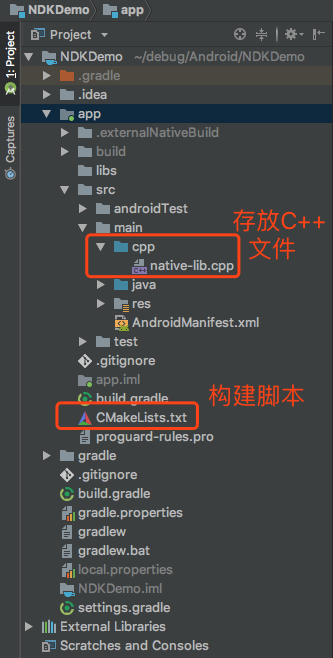
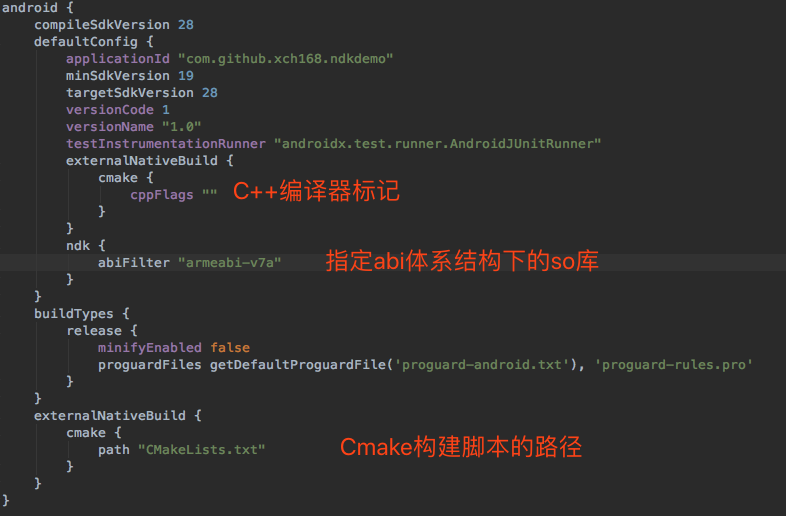
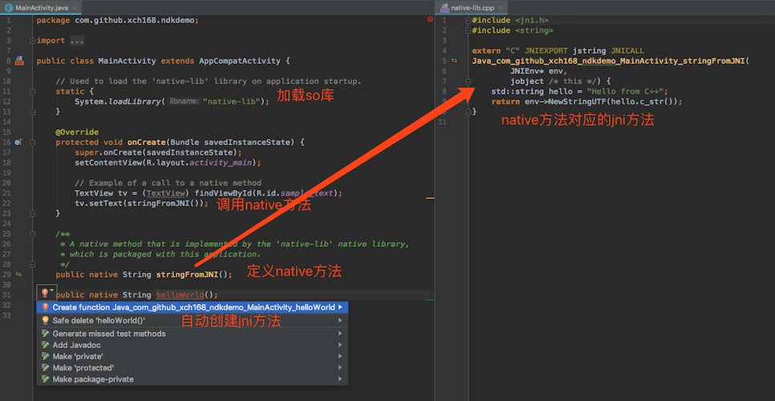

### 概述

`NDK`全称Native Development Kit，是一组可以让您在Android应用中利用C和C++代码的工具。

<!--more-->

使用NDK的好处：

`安全`：APK的Java层代码很容易被反编译，而C/C++库反编译难度较大。

`效率`：将要求高性能的应用逻辑使用C开发，从而提高应用程序的执行效率。

`移植`：用C/C++写的库可以方便在其他的嵌入式平台上再次使用，如在Android、iOS使用。

`复用`：可以方便地使用现存的开源库。大部分现存的开源库都是用C/C++代码编写的，如音视频处理库FFmpeg。

### 环境搭建

#### 开发工具

Android Studio 3.2

#### 下载NDK

`LLDB`：是C/C++的调试器，可以用来做NDK开发的调试。

下载后的NDK位置(Mac)：`/Users/你的用户名/Library/Android/sdk/ndk-bundle `

### 使用NDK

#### 创建一个支持NDK的Project

#### 目录结构

#### Gradle配置

#### CMakeLists.txt构建脚本配置

#### 编写代码

#### 生成so库

生成的so库会自动打包到apk中，不需要手动去移动。

使用`Analyze Apk`工具查看打包apk中的so库

### 参考链接

1. [NDK开发－简介&环境搭建](https://blog.csdn.net/a396901990/article/details/51872849)

