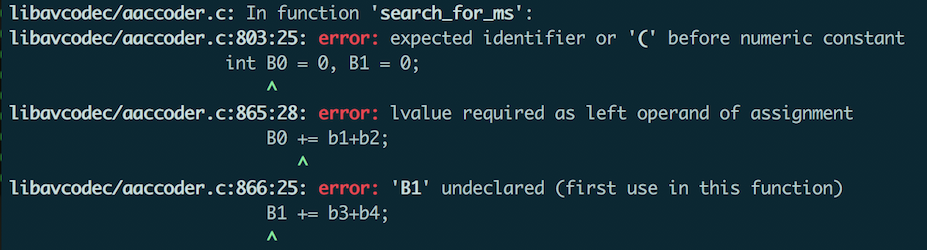
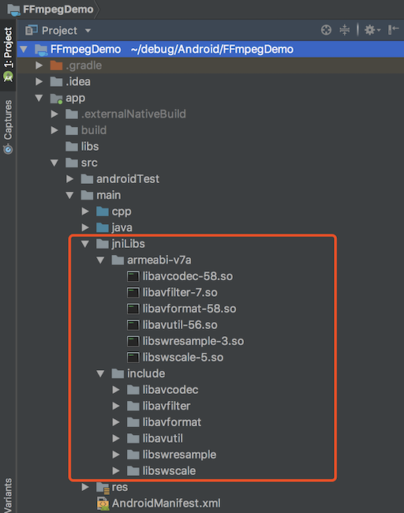

### 概述

> FFmpeg是一套可以用来记录、转换数字音频、视频，并能将其转换成流的开源程序。它提供了录制、转换以及流化音视频的完整解决方案。

<!--more-->

### 下载NDK

- 通过Android Studio下载

  

- 到官网下载

  > https://developer.android.com/ndk/downloads/

### 下载FFmpeg源码

- 通过git clone

  ```shell
  git clone https://github.com/FFmpeg/FFmpeg.git
  ```

- 到官网下载

  > http://ffmpeg.org/download.html#repositories

### 配置configure

由于默认configure脚本编译出来的动态库版本号在文件名后缀.so之后，如：libavcodec.so.7

所以需要对configure进行修改：

```bash
# SLIBNAME_WITH_MAJOR='$(SLIBNAME).$(LIBMAJOR)'
# LIB_INSTALL_EXTRA_CMD='$$(RANLIB) "$(LIBDIR)/$(LIBNAME)"'
# SLIB_INSTALL_NAME='$(SLIBNAME_WITH_VERSION)'
# SLIB_INSTALL_LINKS='$(SLIBNAME_WITH_MAJOR) $(SLIBNAME)'
#
# 将上面四个变量的值改成如下：
SLIBNAME_WITH_MAJOR='$(SLIBPREF)$(FULLNAME)-$(LIBMAJOR)$(SLIBSUF)'  
LIB_INSTALL_EXTRA_CMD='$$(RANLIB)"$(LIBDIR)/$(LIBNAME)"'  
SLIB_INSTALL_NAME='$(SLIBNAME_WITH_MAJOR)'  
SLIB_INSTALL_LINKS='$(SLIBNAME)'
```

### 使用android-ndk-r15c编译FFmpeg3.3.7

编写编译脚本`build-android-ffmpeg.sh`

```bash
#!/bin/bash

# ndk环境    
export NDK=/Users/xch/debug/ndk/android-ndk-r15c
export SYSROOT=$NDK/platforms/android-21/arch-arm
export TOOLCHAIN=$NDK/toolchains/arm-linux-androideabi-4.9/prebuilt/darwin-x86_64
CPU=armv7-a

# 要保存动态库的目录，这里保存在源码根目录下的android/armv7-a
export PREFIX=$(pwd)/android/$CPU
ADDI_CFLAGS="-marm"

function build_android
{
    echo "开始编译ffmpeg"

    ./configure \
        --target-os=linux \
        --prefix=$PREFIX \
        --enable-cross-compile \
        --enable-shared \
        --disable-static \
        --disable-doc \
        --disable-ffmpeg \
        --disable-ffplay \
        --disable-ffprobe \
        --disable-avdevice \
        --disable-doc \
        --disable-symver \
        --cross-prefix=$TOOLCHAIN/bin/arm-linux-androideabi- \
        --arch=arm \
        --sysroot=$SYSROOT \
        --extra-cflags="-Os -fpic $ADDI_CFLAGS" \
        --extra-ldflags="$ADDI_LDFLAGS" \
        $ADDITIONAL_CONFIGURE_FLAG

    make clean

    make -j16
    make install

    echo "编译结束！"
}

build_android
```

编译结果：


### 使用android-ndk-r17b编译FFmpeg4.0.2

编译脚本`build-android-ffmpeg.sh`:

```bash
#!/bin/bash

# ndk环境    
export NDK=/Users/xch/debug/ndk/android-ndk-r17b
export SYSROOT=$NDK/platforms/android-21/arch-arm
export TOOLCHAIN=$NDK/toolchains/arm-linux-androideabi-4.9/prebuilt/darwin-x86_64
CPU=armv7-a

ISYSROOT=$NDK/sysroot
ASM=$ISYSROOT/usr/include/arm-linux-androideabi

# 要保存动态库的目录，这里保存在源码根目录下的android/armv7-a
export PREFIX=$(pwd)/android/$CPU
ADDI_CFLAGS="-marm"

function build_android
{
    echo "开始编译ffmpeg"

    ./configure \
        --target-os=linux \
        --prefix=$PREFIX \
        --enable-cross-compile \
        --enable-shared \
        --disable-static \
        --disable-doc \
        --disable-ffmpeg \
        --disable-ffplay \
        --disable-ffprobe \
        --disable-avdevice \
        --disable-doc \
        --disable-symver \
        --cross-prefix=$TOOLCHAIN/bin/arm-linux-androideabi- \
        --arch=arm \
        --sysroot=$SYSROOT \
        --extra-cflags="-I$ASM -isysroot $ISYSROOT -D__ANDROID_API__=21 -U_FILE_OFFSET_BITS -Os -fPIC -DANDROID -Wno-deprecated -mfloat-abi=softfp -marm" \
        --extra-ldflags="$ADDI_LDFLAGS" \
        $ADDITIONAL_CONFIGURE_FLAG

    make clean

    make -j16
    make install

    echo "编译结束！"
}

build_android
```

编译过程错误处理：

错误1：变量名与宏定义冲突



解决方法：将B0修改为b0，一共4处。

错误2：


解决：将libavcodec/hevc_mvs.c中的B0改为b0。

错误3：


解决：将libavcodec/opus_pvq.c中的B0改为b0。

**NOTE:** 

android-ndk-r16b之前版本的头文件位于`{NDK_HOME}/platforms/{android-21}/{arch-arm}/usr/include`，r16b及之后的版本头文件位于`{NDK_HOME}/sysroot/usr/include`

### 使用编译好的so库

Step1:  在Android Studio创建一个工程，并勾选“Include C++ support”；


Step2: 创建一个`jniLibs`目录，并把编译好的`头文件`和`.so`文件都复制到该目录；



Step3: 配置gradle文件:

```groovy
externalNativeBuild {
    cmake {
        cppFlags "-frtti -fexceptions"
        abiFilters 'armeabi-v7a'
    }
}
```

```groovy
sourceSets.main {
    jniLibs.srcDirs = ['src/main/jniLibs']
}
```

Step4: 编辑CMakeLists.txt文件:

```cmake
cmake_minimum_required(VERSION 3.4.1)

add_library( MyFFmpeg
             SHARED
             src/main/cpp/native-lib.cpp )

find_library( log-lib
              log )

find_library( android-lib
              android )

# 设置ffmpeg库所在路径的目录
set(distribution_DIR ${CMAKE_SOURCE_DIR}/src/main/jniLibs/${ANDROID_ABI})

add_library( avutil-56
        SHARED
        IMPORTED )
set_target_properties( avutil-56
        PROPERTIES IMPORTED_LOCATION
        ${distribution_DIR}/libavutil-56.so)

add_library( swresample-3
        SHARED
        IMPORTED )
set_target_properties( swresample-3
        PROPERTIES IMPORTED_LOCATION
        ${distribution_DIR}/libswresample-3.so)

add_library( avfilter-7
        SHARED
        IMPORTED )
set_target_properties( avfilter-7
        PROPERTIES IMPORTED_LOCATION
        ${distribution_DIR}/libavfilter-7.so)

add_library( avformat-58
        SHARED
        IMPORTED )
set_target_properties( avformat-58
        PROPERTIES IMPORTED_LOCATION
        ${distribution_DIR}/libavformat-58.so)

add_library( swscale-5
        SHARED
        IMPORTED )
set_target_properties( swscale-5
        PROPERTIES IMPORTED_LOCATION
        ${distribution_DIR}/libswscale-5.so)

add_library( avcodec-58
        SHARED
        IMPORTED )
set_target_properties( avcodec-58
        PROPERTIES IMPORTED_LOCATION
        ${distribution_DIR}/libavcodec-58.so)

# 添加ffmpeg头文件路径
include_directories(src/main/jniLibs/include)

target_link_libraries( MyFFmpeg
        avcodec-58
        avfilter-7
        avformat-58
        avutil-56
        swresample-3
        swscale-5
        ${log-lib}
        ${android-lib} )
```

Step5: 编写代码：

Java层：

```java
public class MainActivity extends AppCompatActivity {

    static {
        System.loadLibrary("MyFFmpeg");
    }

    public native String avformatInfo();
    public native String avcodecInfo();
    public native String avfilterInfo();
    public native String configurationInfo();

    private TextView mInfoView;

    @Override
    protected void onCreate(Bundle savedInstanceState) {
        super.onCreate(savedInstanceState);
        setContentView(R.layout.activity_main);

        mInfoView = findViewById(R.id.info);
    }


    public void format(View view) {
        mInfoView.setText(avformatInfo());
    }

    public void codec(View view) {
        mInfoView.setText(avcodecInfo());
    }

    public void filter(View view) {
        mInfoView.setText(avfilterInfo());
    }

    public void config(View view) {
        mInfoView.setText(configurationInfo());
    }
}
```

C++层：

```c++
#include <jni.h>
#include <string>


extern "C" {
#include "libavformat/avformat.h"
#include "libavcodec/avcodec.h"
#include "libavutil/avutil.h"
#include "libavfilter/avfilter.h"

JNIEXPORT jstring JNICALL
Java_com_github_xch168_ffmpegdemo_MainActivity_avformatInfo(JNIEnv *env, jobject instance) {

    char info[40000] = { 0 };

    AVInputFormat *if_temp = av_iformat_next(NULL);
    AVOutputFormat *of_temp = av_oformat_next(NULL);
    //Input
    while (if_temp != NULL){
        sprintf(info, "%s[In ][%10s]\n", info, if_temp->name);
        if_temp = if_temp->next;
    }
    //Output
    while (of_temp != NULL) {
        sprintf(info, "%s[Out][%10s]\n", info, of_temp->name);
        of_temp = of_temp->next;
    }

    return env->NewStringUTF(info);
}

JNIEXPORT jstring JNICALL
Java_com_github_xch168_ffmpegdemo_MainActivity_avcodecInfo(JNIEnv *env, jobject instance) {

    char info[40000] = { 0 };

    AVCodec *c_temp = av_codec_next(NULL);

    while (c_temp!=NULL) {
        if (c_temp->decode!=NULL){
            sprintf(info, "%s[Dec]", info);
        }
        else{
            sprintf(info, "%s[Enc]", info);
        }
        switch (c_temp->type) {
            case AVMEDIA_TYPE_VIDEO:
                sprintf(info, "%s[Video]", info);
                break;
            case AVMEDIA_TYPE_AUDIO:
                sprintf(info, "%s[Audio]", info);
                break;
            default:
                sprintf(info, "%s[Other]", info);
                break;
        }
        sprintf(info, "%s[%10s]\n", info, c_temp->name);


        c_temp=c_temp->next;
    }

    return env->NewStringUTF(info);
}

JNIEXPORT jstring JNICALL
Java_com_github_xch168_ffmpegdemo_MainActivity_avfilterInfo(JNIEnv *env, jobject instance) {

    char info[40000] = { 0 };
    AVFilter *f_temp = (AVFilter *)avfilter_next(NULL);
    while (f_temp != NULL){
        sprintf(info, "%s[%10s]\n", info, f_temp->name);
        f_temp = f_temp->next;
    }


    return env->NewStringUTF(info);
}

JNIEXPORT jstring JNICALL
Java_com_github_xch168_ffmpegdemo_MainActivity_configurationInfo(JNIEnv *env, jobject instance) {

    char info[10000] = {0};

    sprintf(info, "%s\n", avcodec_configuration());


    return env->NewStringUTF(info);
}
}
```

运行结果：


### 参考链接

1. [Android 基于ffmpeg开发简易播放器 - NDK交叉编译ffmpeg](https://juejin.im/post/5b1ddc84e51d4506d73f2b3b?utm_source=gold_browser_extension)
2. [在Mac下使用NDK编译FFmpeg3.3.4](https://www.jianshu.com/p/5d738f645697)
3. [Ubuntu编译Android版本FFmpeg](https://blog.csdn.net/tyutccser/article/details/80619065)
4. [Unified Headers](https://android.googlesource.com/platform/ndk/+/master/docs/UnifiedHeaders.md#supporting-unified-headers-in-your-build-system)
5. [Android最简单的基于FFmpeg的例子(一)---编译FFmpeg类库](http://www.ihubin.com/blog/android-ffmpeg-demo-1/)
6. [Android最简单的基于FFmpeg的例子(二)---测试编译好的SO库](http://www.ihubin.com/blog/android-ffmpeg-demo-2/)