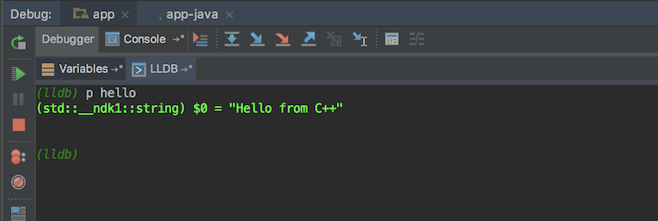

### 概述

> LLDB是一个高效的C/C++调试器，与LLVM编译器一起使用，提供了丰富的流程控制和数据监测，有效的帮助我们调试程序。

<!--more-->

### LLDB安装

### Debug JNI

JNI的调试方式和Java的调试方式差不多，先设置`断点`，然后点击`Debug`，进入调试模式。

当程序运行到断点的时候就会停下来，这时在Debug面板可以看到变量的值和指针地址：

### 使用LLDB

进入到Debug模式后，在`Variables`Tab的旁边有一个`LLDB`的Tab，切换到`LLDB`Tab，就可以使用LLDB命令进行调试，**LLDB命令有很多强大的功能，比如：打印、寻址、调用堆栈等，通过这些命令可以有效的帮助调试NDK程序。**

- `print (p)` 打印命令，打印变量及其值：

  

- `po` 仅打印变量的值：

  

- &nbsp;`expr` 可以在调试时动态执行指定表达式，并打印结果，用于在调试过程中修改变量的值：

  执行expr命令前：

  

  执行expr命令

  

  执行expr命令后：

  

- `call`命令，一般只在不需要显示输出或是方法无返回值时使用：

  

  

- `bt`命令用来打印堆栈信息，加`all`可打印所有thread的堆栈：

  

  

- `image`命令用于寻址，可以用来查找栈地址对应的代码位置：

  > image lookup --address 0xfxxxxx
  >
  > `0xfxxxxx`：表示对应的栈地址

  

### 参考链接

1. [Andorid Studio NDK开发-LLDB调试](https://juejin.im/post/58dae3a5ac502e0058ee242f)
2. [The LLDB Debugger](http://lldb.llvm.org/)

