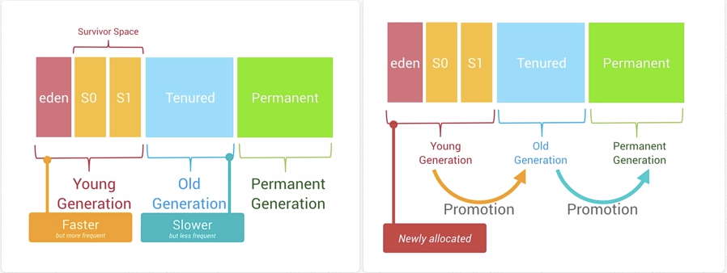
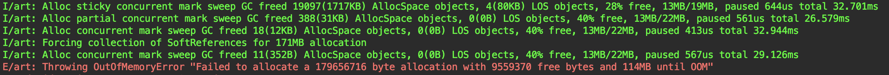
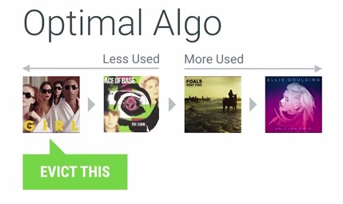
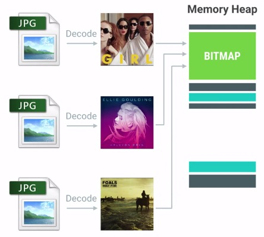
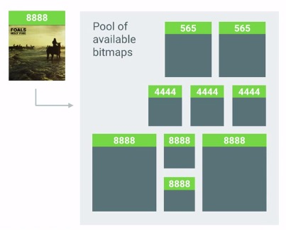
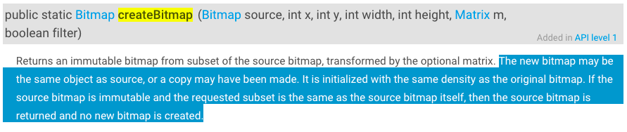

### 概述

>OOM(Out of Memory)即内存溢出，是因为应用所需要分配的内存超过系统对应用内存的阈值，而抛出的`java.lang.OutOfMemoryError`错误。
>
>OOM的根本原因是开发者对内存使用不当造成的。

<!--more-->

### Android内存分配与回收机制

> Android系统仅会在新的内存分配之前判断Heap的尾端剩余空间是否足够，如果不够就会触发GC操作，从而腾出更多空闲的内存空间。

#### 内存分配

> Android的Heap空间是一个`Generational Heap Memory`的模型，最近分配的对象会存放在`Young Generation`区域，当一个对象在这个区域停留的时间达到一定程度，它会被移动到`Old Generation`，最后累积一定时间再移动到`Permanent Generation`区域。



#### 内存回收

>系统会根据内存中不同的内存数据类型分别执行不同的GC操作。例如，刚分配到`Young Generation`区域的对象通常更容易被销毁回收，同时在`Young Generation`区域的gc操作速度回比`Old Generation`区域的gc速度更快。
>
>每一个Generation的内存区域都有固定的大小，随着新的对象陆续被分配到此区域，当这些对象总的大小快达到这一级别内存区域的阈值时，会触发GC操作，以腾出空间来存放其他新的对象。
>
>通常情况下，GC发生的时候，所有的线程都是会被暂停的。执行GC所占用的时间和它发生在哪一个Generation也有关系，`Young Generation`中每次GC操作时间是最短的，`Old Generation`其次，`Permanent Generation`最长。执行时间的长短也和当前Generation中的对象数量有关。


#### 获取内存的阈值

> 为了整个Android系统的内存控制需要，Android系统为每个应用程序都设置了一个硬性的`Dalvik Heap Size`最大限制阈值，这个阈值在不同的设备上回因为RAM大小不同而有所差异。如果你的应用占用内存空间已经接近这个阈值，此时再尝试分配内存的话，很容易引起`OutOfMemoryError`的错误。

```java
// 获取Heap Size阈值
ActivityManager am = (ActivityManager)context.getSystemService(Context.ACTIVITY_SERVICE);
// 返回值是以Mb为单位
int memoryClass = am.getMemoryClass();
```

### OOM触发条件

> 只要allocated + 新分配的内存 >= getMemoryClass()的时候就会发生OOM。



### 避免OOM的方法

#### 减小对象的内存占用

> 避免OOM的第一步就是要尽量减少新分配出来的对象占用内存的大小，尽量使用更加轻量级的对象。

**1. 使用更加轻量的数据结构**

> 使用`ArrayMap`/`SparseArray`替代HashMap等传统数据结构。
>
> `ArrayMap`是Android系统专为移动操作系统编写的容器，在大多数情况下，比HashMap效率更高，占用内存更少。
>
> `SparseArray`更加高效在于它们避免了对key和value的autobox自动装箱，并且避免了装箱后的解箱。

**2. 避免在Android里面使用Enum**

> Android官方说明”**Enums often require more than twice as much memory as static constants. You should strictly avoid using enums on Android.**“，所以应避免在Android里面使用枚举。

**3. 减小Bitmap对象的内存占用**

> Bitmap是一个极容易消耗内存的大胖子，减小创建处理的Bitmap的内存占用是很重要的，通常来说有下面2个措施：
>
> - inSampleSize：缩放比例，在把图片载入内存之前，我们需要先计算出一个合适的缩放比例，避免不必要的大图载入。
> - decode format：解码格式，选择`ARGB_8888`/`RGB_565`/`ARGB_4444`/`ALPHA_8`，存在很大差异。

**4. 使用更小的图片**

> 对应资源图片，要特别留意这张图片是否存在可压缩的空间，是否可以使用一张更小的图片。尽量使用更小的图片不仅仅可以减少内存的使用，还可以避免出现大量的`InflationException`。假设有一张很大的图片被XML文件直接引用，很有可能在初始化视图的时候会因为内存不足而发生`InflationException`，这个问题的根本原因其实是发生了OOM。

#### 内存对象的重复利用

>大多数对象的复用，最终实施的方案都是利用对象池技术，要么是在编写代码的时候显示的在程序里面去创建对象池，然后处理好复用的实现逻辑，要么就是利用系统框架既有的某些复用特性达到减少对象的重复创建，从而减少内存的分配与回收。

> 在Android上面最常用的一个缓存算法是LRU(Least Recently Use)，建议操作原理如下图所示：



**1. 复用系统自带的资源**

> Android系统本身内置了许多的资源，如字符串、颜色、图片、动画、样式以及简单布局等，这些资源可以在应用程序中直接使用。这样做不仅仅可以减少应用程序的自身负重，减小APK的大小。但是要留意Android系统的版本差异性。

**2. 注意在ListView/GridView等出现大量重复子组件的视图里面对ConvertView的复用**
**3. Bitmap对象的复用**

> 在RecyclerView、ListView、GridView等显示大量图片的控件里面需要使用LRU机制来缓存处理好的Bitmap。

> 利用`inBitmap`的高级特性提高Android系统在Bitmap分配与释放执行效率上的提升。使用`inBitmap`属性可以告知Bitmap解码器去尝试使用已经存在的内存区域，新解码的bitmap会尝试去使用之前那张bitmap在heap中所占据的`pixel data`内存区域，而不是去问内存重新申请一块区域来存放bitmap。利用这种特性，即使是上千张的图片，也只会仅仅只需要占用屏幕所能够显示的图片数量的大小。



使用inBitmap需要注意的几个限制条件：

- 在SDK 11~18之间，重用的bitmap大小必须是一致的，例如给inBitmap赋值的图片大小为100x100，那么新申请的bitmap必须也为100x100才能够被重用。从SDK 19开始，新申请的bitmap大小必须小于或等于已经赋值过的bitmap大小。

- 新申请的bitmap与旧的bitmap必须有相同的解码格式，例如前面的bitmap是8888，那么久不能支持4444和565格式的bitmap了。我们可以创建一个包含多种典型可重用bitmap的对象池，这样后续的bitmap创建都能找到合适的”模板“去进行重用。

  

**4. 避免在onDraw方法里面执行对象的创建**

> 类似onDraw等频繁调用的方法，一定需要注意避免在这里做创建对象的操作，因为它会迅速增加内存的使用，而且很容易引起频繁的GC，甚至是内存抖动。

**5. StringBuilder**

> 当代码中需要使用到大量的字符串拼接操作，就有必要考虑使用StringBuilder来代替频繁的”+“。

#### 避免对象的内存泄漏

>内存对象的泄漏，会导致一些不再使用的对象无法及时释放，这样一方面占用了宝贵的内存空间，很容易导致后续需要分配内存的时候，空闲空间不足而出现OOM。显然，这还使得每级Generation的内存区域可用空间变小，GC就会更容易被触发，容易出现内存抖动，从而引起性能问题。

**1. 注意Activity的泄漏**

> 通常来说，Activity的泄漏是内存泄漏里面最为严重的问题，它占用的内存最多，影响面广。
>
> 导致Activity泄漏的两种情况：
>
> - 内部类引用导致Activity的泄漏
> - Activity Context被传递到其他实例中，这可能导致自身被引用而发生泄漏。

**2. 考虑使用Application Context而不是Activity Context**

> 对于大部分非必须使用Activity Context的情况（Dialog的Context就必须是Activity Context），都可以考虑使用Application Context而不是Activity的Context，这样就可以避免不经意的Activity泄漏。

**3. 注意临时Bitmap对象的及时回收**

> 临时创建的某个相对比较大的bitmap对象，在经过转换得到新的bitmap对象之后，应该尽快回收原始的bitmap，这样能够更快释放原始bitmap所占用的空间。

**注意Bitmap类里面提供的`createBitmap()方法`**：



这个函数返回的bitmap有可能和source bitmap是同一个，在回收的时候，需要特别检查source bitmap与return bitmap的引用是否相同，只有在不等的情况下，才能够执行source bitmap的recycle方法。

**4. 注意监听器的注销**

> 在Android程序里面存在很多需要register和unregister的监听器，需要确保在合适的时候及时unregister那些监听器。手动add的listener，需要记得及时remove这个listener。

**5. 注意缓存容器中的对象泄漏**

> 如果容器是静态或者全局的，那么对于里面存放的对象要及时remove。

**6. 注意WebView的泄漏**

> Android中WebView存在很大的兼容性问题，需要再合适的时机进行销毁。

**7. 注意Cursor对象是否及时关闭**

> 对于数据库查询的Cursor，如果没有及时关闭就会造成泄漏。

### 参考链接

1. [Android内存优化之OOM](http://hukai.me/android-performance-oom/)
2. [Android性能优化之内存篇](http://hukai.me/android-performance-memory/)
3. [Android OOM 解决方案](https://www.cnblogs.com/scetopcsa/p/4005398.html)
4. [android内存泄漏 OOM查找总结](https://www.jianshu.com/p/ed88b12cc65e)
5. [Android OOM案例分析](https://mp.weixin.qq.com/s/UQj4_SdoLW93SmxPszZPdA?)
6. [不可思议的OOM](https://www.jianshu.com/p/e574f0ffdb42)