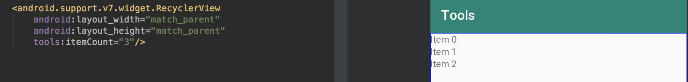

#### 一、概述

> Android Studio在`tools`命名空间中支持一些XML属性来开关设计功能和编译时行为。当构建应用时，构建工具会删除这些属性，从而不会影响APK的大小和运行行为。

<!--more-->

#### 二、引入`tools`命名空间

```xml
<RootTag xmlns:android="http://schemas.android.com/apk/res/android"
    xmlns:tools="http://schemas.android.com/tools" >
```

#### 三、XML视图预览相关属性

##### 1. `tools:`替代`android:`

示例1：预览时展示指定文本。


示例2：`tools:text`和`android:text`同时存在，在预览时`tools:text`属性会覆盖`android:text`属性。


##### 2. tools:context

声明该布局文件默认关联的Activity，这样可以在预览的时候就知道展示的主题，并且知道在哪插入`onClick`对应的处理事件。

示例1：为Activity指定主题


示例2：快速创建`onClick`的事件处理方法


##### 3. tools:itemCount

用在`RecyclerView`用来指定预览几项



##### 4. tools:layout

这个属性用来声明这个fragment内部所加载展示的布局


##### 5. tools:listitem

用在ListView用来指定其item的布局


##### 6. tools:showIn

指定这个View被`<include>`到哪个layout中

```xml
<TextView xmlns:android="http://schemas.android.com/apk/res/android"
    xmlns:tools="http://schemas.android.com/tools"
    android:text="@string/hello_world"
    android:layout_width="wrap_content"
    android:layout_height="wrap_content"
    tools:showIn="@layout/activity_main" />
```

##### 7.` @tools:sample/*`资源

为View设置占位文本或图片


| 属性值                            | 描述   |
| --------------------------------- | ------ |
| @tools:sample/full_names          | 姓名   |
| @tools:sample/date/ddmmyy         | 日期   |
| @tools:sample/avatars             | 头像   |
| @tools:sample/backgrounds/scenicb | 背景图 |

#### 四、资源压缩相关属性

开启资源压缩

```groovy
android {
    ...
    buildTypes {
        release {
            shrinkResources true  // 开启资源压缩。minifyEnabled也必须为true，否则编译不通过
            minifyEnabled true    // 开启代码混淆/压缩
            proguardFiles getDefaultProguardFile('proguard-android.txt'),
                    'proguard-rules.pro'
        }
    }
}
```

##### 1. tools:shrinkMode

这个属性允许你指定构建工具是否使用“安全模式”(`shrinkMode="safe"`)或“严格模式”(`shrinkMode="strict"`)

```xml
<?xml version="1.0" encoding="utf-8"?>
<resources xmlns:tools="http://schemas.android.com/tools"
    tools:shrinkMode="strict" />
```

当启用严格模式，需要使用`tools:keep`来保持那些真实需要但又被删除的资源，使用`tools:discard`来明确删除更多的资源

##### 2. tools:keep

这个属性允许你指定那些运行时间接引用的资源。例如动态生成的资源名称传递给`Resources.getIdentifier()`

可以创建一个XML文件，如`res/raw/keep.xml`，以`<resources>`为根标签

```xml
<?xml version="1.0" encoding="utf-8"?>
<resources xmlns:tools="http://schemas.android.com/tools"
    tools:keep="@layout/used_1,@layout/used_2,@layout/*_3" />
```

##### 3. tools:discard

这个属性允许你手动指定需要被删除的资源。(一般因为资源被引用但是没有作用于app，或者因为Gradle插件的误报这个资源被引用)

```xml
<?xml version="1.0" encoding="utf-8"?>
<resources xmlns:tools="http://schemas.android.com/tools"
    tools:discard="@layout/unused_1" />
```

#### 五、错误处理相关属性

以下属性用于过滤`Lint`警告消息

##### 1. tools:ignore

该属性可以作用于任何元素，接受逗号分隔的lint Issue列表。

示例：如果对文本进行硬编码时，XML代码将会变黄；添加`tools:ignore="HardcodedText"`即可让lint忽略警告


##### 2. tools:targetApi

指明某个控件只在指定的API 及更高的版本中生效。这样，在使用 Lint 检测时就不会因 minSdkVersion 低于控件出现的版本而报错。

```xml
<GridLayout xmlns:android="http://schemas.android.com/apk/res/android"
    xmlns:tools="http://schemas.android.com/tools"
    tools:targetApi="14" >
```

##### 3. tools:locale

指明 resources 中元素的语言类型，避免拼写检查或者Lint 检查时报错。

例如，可以添加到`values/strings.xml`

```xml
<resources xmlns:tools="http://schemas.android.com/tools"
    tools:locale="es">
```

#### 参考链接

1. [Tools attributes reference](https://developer.android.com/studio/write/tool-attributes)
2. [Android:Tools命名空间原来是有大用处的](https://www.jianshu.com/p/2912bcba4465)