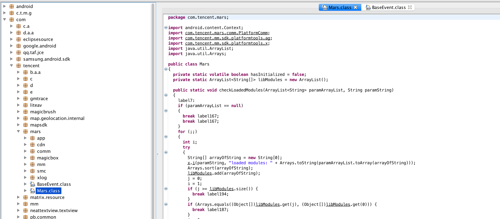

### 一、概述

如果看到某款应用的功能很好奇，而对于其实现方式一头雾水。那么就可以对其进行反编译，来获取其中的实现方式。

`Apktool`: 

1. 可以用来将资源恢复到原来的形式，包括`resources.arc` 、`classes.dex`、`9.png` 和`XML文件`
2. 可以将反编译后的资源文件重新打包成二进制的APK/JAR文件

`dex2jar`: 用来将`classes.dex`转为jar文件

`JD-GUI`: 用来将查看jar文件，机制是将jar中的.class文件转为.java文件
<!-- more-->

### 二、准备工作(Mac版)

- ApkTool：

  - 下载地址：[ApkTool运行脚本](https://ibotpeaches.github.io/Apktool/install/)、[ApkTool运行库](https://ibotpeaches.github.io/Apktool/)

  - 安装： 

  1.  将`apktool_x.x.x.jar`命名为`apktool.jar`

  2. 将`apktool`脚本、`apktool.jar`文件移动到`/usr/local/bin`目录下

  3. 为上述两个文件增加可执行权限，命令如下:

    ```bash
    chmod +x apktool
    chmod +x apktool.jar
    ```

- dex2jar:

  - 下载地址：[dex2jar](https://sourceforge.net/projects/dex2jar/files/)

  - 安装：

  1. 将下载好的dex2jar压缩包解压，将`d2j-dex2jar.sh`重命名为`dex2jar.sh`(这个命令最常用，名称短一点好)

  2. 将解压后的文件夹复制到`/usr/local/bin`目录下

  3. 为`d2j_invoke.sh`增加可执行权限

    ```bash
    chmod +x d2j_invoke.sh
    ```

  4. 配置环境变量(因为dex2jar可执行文件下`/usr/local/bin`的子目录下，所有要配置环境变量)：

    ```bash
    # 1. 打开.bash_profile文件，并添加如下配置：
    export PATH=$PATH:/usr/local/bin/dex2jar
    # 2. 执行命令：source ~/.bash_profile，让配置立即生效
    ```

- JD-GUI:
  1. 下载地址：[JD-GUI](http://jd.benow.ca/)
  2. 安装：解压后，将`JD-GUI.app`复制到`Applications`文件夹，然后点击即可使用

### 三、使用Apktool反编译apk获取资源文件

```bash
# 在终端执行如下命令，就会在apk文件目录下创建一个和apk同名的文件夹，该文件夹中放的是反编译的资源文件
apktool d /xxx/xxx/xxx.apk

# 将反编译后的文件重新打包
apktool b /xx/xx/xxx
```

### 四、使用dex2jar将dex反编译成jar

1. 使用解压软件将apk文件解压

2. 在终端执行如下命令：

   ```bash
   # cd 到apk解压的目录，然后执行命令(apk解压目录中可能有多个.dex文件，要分别反编译)，
   dex2jar classes.dex
   ```

### 五、JD-GUI的使用

​	直接打开`JD-GUI.app`，然后将通过`dex2jar`反编译后的`.jar`文件拖动到`JD-GUI`就可以查看到反编译后的java代码了。(反编译后会出现abc这样的类和包名，是因为作者对代码进行了混淆，这样反编译后代码的可读性变差)



### 六、总结

使用这些工具是为了让我们更好的学习代码，写出更好的代码。