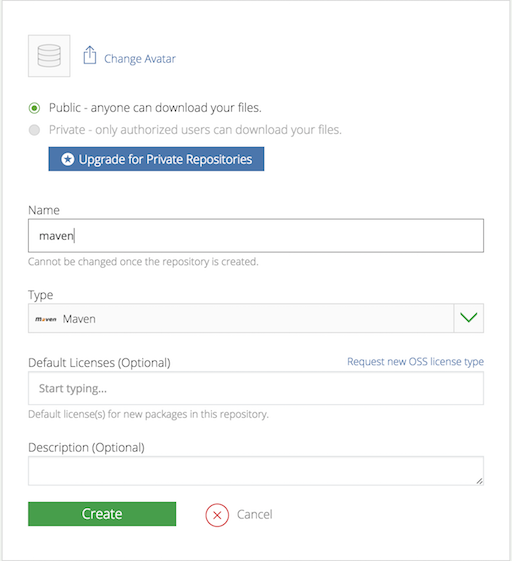
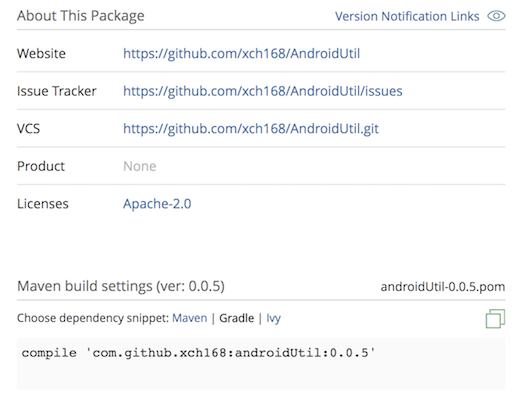
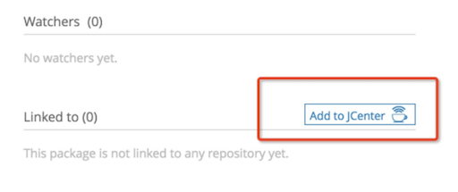

1. 前往https://bintray.com/ 注册账号

2. 在bintray中创建一个maven仓库
<!-- more -->


3. 在Android项目中的根build.gradle中，添加如下代码：
```groovy
dependencies {
    // ...
    classpath 'com.novoda:bintray-release:0.5.0'
}
```

4. 在local.properties文件中添加bintray的用户名和API key
```groovy
bintray.user=xxxxx
bintray.key=xxxxxxxx
```

5. 在项目根目录下创建secret.gradle用于读取local.properties中配置的用户名和API KEy
```groovy
//加载资源
Properties properties = new Properties()
InputStream inputStream = project.rootProject.file('local.properties').newDataInputStream()
properties.load( inputStream )

//读取字段
ext.bintray_key = properties.getProperty('bintray.key')
ext.bintray_user = properties.getProperty('bintray.user')
```

6. 在library所在的module中的build.gradle中，添加bintray-release插件的应用和secret.gradle的配置；
```groovy
apply plugin: 'com.novoda.bintray-release'
apply from: rootProject.file("secret.gradle")
```

7. 在library所在的module中的build.gradle中，添加发布到JCenter的参数配置；
```groovy
publish {
    userOrg = 'xch168'            // bintray.com用户名
    groupId = 'com.github.xch168' // jcenter上的路径
    artifactId = 'androidUtil'    // 项目名称
    publishVersion = '0.0.5'      // 版本号
    desc = 'Oh hi, this is a nice description for a project, right?' // 描述，不重要
    website = 'https://github.com/xch168/AndroidUtil'                // 网站，不重要；可以填写GitHub中的项目地址

    bintrayUser = bintray_user // bintray.com的用户名
    bintrayKey = bintray_key   // bintray.com的API key
}
```

8. 在项目根目录下创建快速发布脚本publish.sh(Mac OS) or publish.bat(Windows)
```bash
// Mac OS
./gradlew clean build generatePomFileForReleasePublication bintrayUpload -PdryRun=false

// Windows
gradlew clean build generatePomFileForReleasePublication bintrayUpload -PdryRun=false
```

9. 执行publish脚本，发布项目，项目发布成功后进入bintray.com，可以看到如下：


10. 将项目同步到JCenter(需要等待审核)



11. 使用自己发布的库
```groovy
compile 'com.github.xch168:androidUtil:0.0.5'
```


