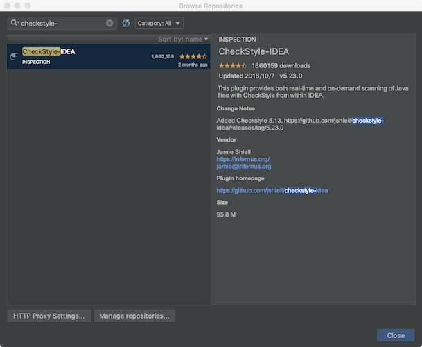

### 概述

>每个团队都会有一套优良统一的代码规范，而规范的检测如果依赖于人工检测就不太现实。
>
>`checkstyle`是一个可以帮我们检查Java代码规范的工具。checkstyle具有很强的配置性。

<!--more-->

### 创建checkstyle.xml配置文件

> - 每个checkstyle配置文件必须包含`Checker`作为根module；
> - `TreeWalker` module用来遍历java文件，并定义一些属性；
> - `TreeWalker` module包含多个子module，用来进行检查规范。

**NOTE**：将`checkstyle.xml`放在项目的根目录。

```xml
<?xml version="1.0"?>
<!DOCTYPE module PUBLIC
    "-//Puppy Crawl//DTD Check Configuration 1.3//EN"
    "http://www.puppycrawl.com/dtds/configuration_1_3.dtd">

<module name="Checker">
    <property name="charset" value="UTF-8"/>

    <!--文件要以空行结尾-->
    <module name="NewlineAtEndOfFile"/>
    <!--限定文件的最大行数：默认为2000行-->
    <module name="FileLength"/>
    <!--不允许使用文件制表符（'\t'）-->
    <module name="FileTabCharacter"/>

    <!--正则表达式单行匹配-->
    <module name="RegexpSingleline">
        <property name="format" value="\s+$"/>
        <property name="message" value="Line has trailing spaces."/>
    </module>

    <!--'for' 和 'if'后需要有空格-->
    <module name="RegexpSingleline">
        <property name="format" value="^\s*(for|if)\b[^ ]"/>
        <property name="message" value="Space needed before opening parenthesis."/>
    </module>

    <!--for中的`;`后应有空格-->
    <module name="RegexpSingleline">
        <property name="format" value="^\s*for \(.*?([^ ]:|:[^ ])"/>
        <property name="message" value="Space needed around ':' character."/>
    </module>

    <module name="TreeWalker">

        <!--Java doc风格-->
        <module name="JavadocStyle"/>

        <!-- 命名规范检查                  -->
        <!-- See http://checkstyle.sf.net/config_naming.html -->
        <!--常量的命名规范："^[A-Z][A-Z0-9]*(_[A-Z0-9]+)*$"-->
        <module name="ConstantName"/>
        <!--局部final变量命名规范："^[a-z][a-zA-Z0-9]*$"-->
        <module name="LocalFinalVariableName"/>
        <!--局部变量命名规范："^[a-z][a-zA-Z0-9]*$"-->
        <module name="LocalVariableName"/>
        <!--成员变量命名规范：以m开头-->
        <module name="MemberName">
            <property name="format" value="^m[A-Z][a-zA-Z0-9]*$"/>
        </module>
        <!--方法名规范-->
        <module name="MethodName"/>
        <!--参数命名规范-->
        <module name="ParameterName"/>
        <!--static变量命名规范-->
        <module name="StaticVariableName"/>
        <!--类型名称规范-->
        <module name="TypeName"/>


        <!-- 导包检查                              -->
        <!-- See http://checkstyle.sf.net/config_import.html -->
        <!--避免通配符导入-->
        <module name="AvoidStarImport"/>
        <!--非法导入-->
        <module name="IllegalImport"/>
        <!--多余导入-->
        <module name="RedundantImport"/>
        <!--未使用导入-->
        <module name="UnusedImports">
            <property name="processJavadoc" value="true"/>
        </module>


        <!-- 度量检查                    -->
        <!-- See http://checkstyle.sf.net/config_sizes.html -->
        <!--代码行的长度-->
        <module name="LineLength">
            <property name="max" value="100"/>
        </module>
        <!--方法的长度-->
        <module name="MethodLength">
            <property name="max" value="200"/>
        </module>


        <!-- 空格检查                               -->
        <!-- See http://checkstyle.sf.net/config_whitespace.html -->
        <!--范型标记空格：如：List < Integer > x = new ArrayList < Integer > (); 这句代码符合规范-->
        <module name="GenericWhitespace"/>
        <!--空格不能作为for循环迭代器空位置的填充符-->
        <module name="EmptyForIteratorPad"/>
        <!--方法左右括号和参数之间不能有空格-->
        <module name="MethodParamPad"/>
        <!--检查指定标记之后没有空格-->
        <module name="NoWhitespaceAfter"/>
        <!--指定标记之前没有空格-->
        <module name="NoWhitespaceBefore"/>
        <!--运算符换行-->
        <module name="OperatorWrap"/>
        <!--左右()之间不能有空格-->
        <module name="ParenPad"/>
        <!--类型转换后应有空格-->
        <module name="TypecastParenPad"/>
        <!--指定标记之后有空格-->
        <module name="WhitespaceAfter"/>
        <!--指定标记周围有空格-->
        <module name="WhitespaceAround">
            <property name="tokens"
                value="ASSIGN, BAND, BAND_ASSIGN, BOR, BOR_ASSIGN, BSR, BSR_ASSIGN, BXOR, BXOR_ASSIGN,
          COLON, DIV, DIV_ASSIGN, DO_WHILE, EQUAL, GE, GT, LAND, LCURLY, LE, LITERAL_CATCH,
          LITERAL_DO, LITERAL_ELSE, LITERAL_FINALLY, LITERAL_FOR, LITERAL_IF, LITERAL_RETURN,
          LITERAL_SWITCH, LITERAL_SYNCHRONIZED, LITERAL_TRY, LITERAL_WHILE, LOR, LT, MINUS,
          MINUS_ASSIGN, MOD, MOD_ASSIGN, NOT_EQUAL, PLUS, PLUS_ASSIGN, QUESTION, SL, SLIST,
          SL_ASSIGN, SR, SR_ASSIGN, STAR, STAR_ASSIGN, LITERAL_ASSERT, TYPE_EXTENSION_AND"/>
        </module>


        <!-- 修饰符检查                                   -->
        <!-- See http://checkstyle.sf.net/config_modifiers.html -->
        <!--修饰符的顺序：1. public 2. protected 3. private 4. abstract 5. static 6. final 7. transient 8. volatile 9. synchronized 10. native 11. strictfp-->
        <module name="ModifierOrder"/>
        <!--多余的修饰符-->
        <module name="RedundantModifier"/>


        <!-- 代码块检查                 -->
        <!-- See http://checkstyle.sf.net/config_blocks.html -->
        <!--避免嵌套代码块-->
        <module name="AvoidNestedBlocks"/>
        <!--空代码块-->
        <module name="EmptyBlock"/>
        <!--需要花括号：可以检查do、else、if、for、while等关键字所控制的代码块-->
        <module name="NeedBraces"/>
        <!--左花括号位置-->
        <module name="LeftCurly"/>
        <!--右花括号位置-->
        <module name="RightCurly"/>


        <!-- 代码检查              -->
        <!-- See http://checkstyle.sf.net/config_coding.html -->
        <!--module name="AvoidInlineConditionals"/-->
        <!--重载equals方法，而没有重写equals(java.lang.Object)方法-->
        <module name="CovariantEquals"/>
        <!--检查空语句-->
        <module name="EmptyStatement"/>
        <!--避免调用空引用的equals方法-->
        <module name="EqualsAvoidNull"/>
        <!--检查覆盖了equals()方法的类是否也覆盖了hashCode()方法-->
        <module name="EqualsHashCode"/>
        <!--module name="HiddenField"/-->
        <!--非法实例化-->
        <module name="IllegalInstantiation"/>
        <!--module name="InnerAssignment"/-->
        <!--module name="MagicNumber"/-->
        <!--缺少switch默认分支-->
        <module name="MissingSwitchDefault"/>
        <!--<module name="RedundantThrows"/>-->
        <!--简化布尔表达式-->
        <module name="SimplifyBooleanExpression"/>
        <!--简化布尔返回值-->
        <module name="SimplifyBooleanReturn"/>

        <!-- 类设计检查                         -->
        <!-- See http://checkstyle.sf.net/config_design.html -->
        <!--module name="DesignForExtension"/-->
        <!--检查一个只有私有构造器的类是否被声明为final-->
        <module name="FinalClass"/>
        <!--隐藏工具类构造器-->
        <module name="HideUtilityClassConstructor"/>
        <!--接口应当描述为一个类型：定义一个只包含常量，但是没有包含任何方法的接口是不合适的-->
        <module name="InterfaceIsType"/>
        <!--module name="VisibilityModifier"/-->


        <!-- 其他杂项检查.                   -->
        <!-- See http://checkstyle.sf.net/config_misc.html -->
        <!--检查数组类型风格：数组括号的位置-->
        <module name="ArrayTypeStyle"/>
        <!--module name="FinalParameters"/-->
        <!--module name="TodoComment"/-->
        <!--大写“L”-->
        <module name="UpperEll"/>

        <!--  让@SuppressWarnings注解可以用在Checkstyle：@SuppressWarnings({"membername"}) -->
        <module name="SuppressWarningsHolder"/>
    </module>
</module>
```


### 配置checkstyle

Step1: 在`gradle`文件夹下创建一个`checkstyle.gradle`文件：

```groovy
apply plugin: 'checkstyle'

checkstyle {
    toolVersion = 8.13
    configFile = rootProject.file('checkstyle.xml')
    ignoreFailures = false
    showViolations = true
}

task checkStyle(type: Checkstyle) {
    source = 'src/main/java'
    include '**/*.java'

    classpath = files()
}

afterEvaluate {
    if (project.tasks.getByName("check")) {
        check.dependsOn('checkStyle')
    }
}
```

Step2: 在需要进行代码检查的module中的`build.gradle`文件中添加：

```groovy
apply from: rootProject.file('gradle/checkstyle.gradle')
```

### 使用checkstyle

**在终端运行命令**：

```bash
# Windows
gradlew checkStyle
# Linux or MacOS
./gradlew checkStyle
```

**运行结果**：


**查看检查报告**：


### git commit执行checkStyle

> 为了保证代码库提交的代码都是符合规范的，就必须在`git commit`前执行`checkStyle`检查代码，但是如果依赖于人工这是不可靠的，好在有`Git Hook`可以来帮我们自动完成这项工作。

> Git Hook简介：Git 能在特定的重要动作发生时触发自定义脚本。这些自定义脚本的放置位置` .git/hooks`，当用` git init`初始化一个新库时，git会在`.git/hooks`目录下放置一些示例脚本。所以为了在执行`git commit`时触发脚本，可以在`.git/hooks`创建一个`pre-commit`脚本。

`.git/hooks/pre-commit`脚本:

```bash
#!/bin/sh
#
# An example hook script to verify what is about to be committed.
# Called by "git commit" with no arguments.  The hook should
# exit with non-zero status after issuing an appropriate message if
# it wants to stop the commit.
#
# To enable this hook, rename this file to "pre-commit".

if git rev-parse --verify HEAD >/dev/null 2>&1
then
  against=HEAD
else
  # Initial commit: diff against an empty tree object
  against=4b825dc642cb6eb9a060e54bf8d69288fbee4904
fi

SCRIPT_DIR=$(dirname "$0")
SCRIPT_ABS_PATH=`cd "$SCRIPT_DIR"; pwd`
$SCRIPT_ABS_PATH/../../gradlew checkStyle
if [ $? -eq 0   ]; then
    echo "checkstyle OK"
else
    exit 1
fi


# If you want to allow non-ASCII filenames set this variable to true.
allownonascii=$(git config --bool hooks.allownonascii)

# Redirect output to stderr.
exec 1>&2

# Cross platform projects tend to avoid non-ASCII filenames; prevent
# them from being added to the repository. We exploit the fact that the
# printable range starts at the space character and ends with tilde.
if [ "$allownonascii" != "true" ] &&
  # Note that the use of brackets around a tr range is ok here, (it's
  # even required, for portability to Solaris 10's /usr/bin/tr), since
  # the square bracket bytes happen to fall in the designated range.
  test $(git diff --cached --name-only --diff-filter=A -z $against |
    LC_ALL=C tr -d '[ -~]\0' | wc -c) != 0
then
  cat <<\EOF
Error: Attempt to add a non-ASCII file name.

This can cause problems if you want to work with people on other platforms.

To be portable it is advisable to rename the file.

If you know what you are doing you can disable this check using:

  git config hooks.allownonascii true
EOF
  exit 1
fi

# If there are whitespace errors, print the offending file names and fail.
exec git diff-index --check --cached $against --
```

**执行git commit**：


**NOTE**: `.git/hooks/pre-commit`是不会被提交到远程仓库，所以要把`pre-commit`脚本放置项目根目录，然后创建复制脚本，这样拿到这份代码的同事只要执行一下命令就可以将`pre-commit`脚本复制到`.git/hooks/`目录。

`init-checkstyle`脚本：

```bash
# Windows: init-checkstyle.bat
copy .\pre-commit .\.git\hooks\

# Linux or MacOS: init-checkstyle
cp ./pre-commit ./.git/hooks/
```

### CheckStyle插件的使用

#### 安装CheckStyle-IDEA插件



#### 添加CheckStyle配置文件


#### 进行代码检查

- 在CheckStyle控制面板


- 右键检查当前文件


### 参考链接

1. [Android代码规范利器： Checkstyle](https://droidyue.com/blog/2016/05/22/use-checkstyle-for-better-code-style/)
2. [使用Checkstyle规范代码](https://blog.csdn.net/naivor/article/details/64939719)
3. [checkstyle doc](http://checkstyle.sourceforge.net/)
4. [详解CheckStyle的检查规则（共138条规则）](https://blog.csdn.net/yang1982_0907/article/details/18086693)
5. [Java代码规范之CheckStyle + Git Hook](http://www.czhzero.com/2016/06/29/checkstyle-githook/)
6. [Android项目git+gradle实现commit时checkstyle检查](https://www.jianshu.com/p/3337e9174c51)
7. [如何利用工具提高你的Android代码质量(Checkstyle、Findbugs、PMD)](https://blog.csdn.net/u014651216/article/details/52813124)
8. [Google Style](http://checkstyle.sourceforge.net/google_style.html)
9. [Square Style](https://github.com/square/okhttp/blob/master/checkstyle.xml)