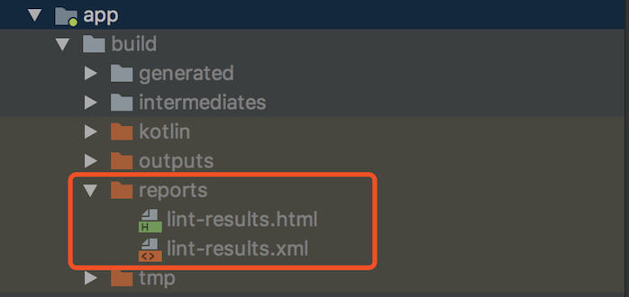

### 概述

> Lint是Android Studio提供的一个代码扫描工具，通过对代码进行静态分析，可以帮助开发者发现代码的质量问题和提出一下改进建议。
>
> Lint工具可检查您的Android项目源文件是否包含潜在错误，以及在正确性、安全性、性能、易用性、便利性和国际化方面是否需要改进优化。

<!--more-->

### Lint的工作流程


应用源文件：源文件包含组成 Android 项目的文件，包括 Java 和 XML 文件、图标和 ProGuard 配置文件等。

`lint.xml`文件：此配置文件可用于指定您希望排除的任何 Lint 检查以及自定义问题严重级别。

Lint工具：可以从命令行或在 Android Studio 中对 Android 项目运行此静态代码扫描工具。

Lint检查结果：可以在控制台或 Android Studio 的 Inspection Results 窗口中查看 Lint 检查结果。

- Correctness：正确性
- Security：安全性
- Performance：性能
- Usability：易用性
- Accessibility：便利性
- I18n：国际化

### 通过 Gradle 运行 Lint

- 在 Windows 上：

  ```bash
  gradlew lint
  ```

- 在 Linux 或 Mac 上：

  ```bash
  ./gradlew lint
  ```

  为特定构建变体运行 `lint` 任务，您必须大写变体名称并在其前面加上 `lint` 前缀。

  ```bash
  gradlew lintDebug
  ```

  Lint 工具完成其检查后，Lint 报告会提供两个路径，分别指向该报告的 XML 和 HTML 版本。

  


### 在Android Studio手动运行检查

**Analyze >Inspect Code** ，手动运行已配置的 Lint 和其他 IDE 检查。检查结果显示在 **Inspection Results** 窗口中。


### 通过 Gradle 配置 Lint 选项

```groovy
android {
    lintOptions {
        // 设置为 true，则当 Lint 发现错误时停止 Gradle 构建
        abortOnError false
        // 设置为 true，则当有错误时会显示文件的全路径或绝对路径 (默认情况下为true)
        absolutePaths true
        // 仅检查指定的问题（根据 id 指定）
        check 'NewApi', 'InlinedApi'
        // 设置为 true 则检查所有的问题，包括默认不检查问题
        checkAllWarnings true
        // 设置为 true 后，release 构建都会以 Fatal 的设置来运行 Lint。
        // 如果构建时发现了致命（Fatal）的问题，会中止构建（具体由 abortOnError 控制）
        checkReleaseBuilds true
        // 不检查指定的问题（根据问题 id 指定）
        disable 'TypographyFractions','TypographyQuotes'
        // 检查指定的问题（根据 id 指定）
        enable 'RtlHardcoded','RtlCompat', 'RtlEnabled'
        // 在报告中是否返回对应的 Lint 说明
        explainIssues true
        // 写入报告的路径，默认为构建目录下的 lint-results.html
        htmlOutput file("lint-report.html")
        // 设置为 true 则会生成一个 HTML 格式的报告
        htmlReport true
        // 设置为 true 则只报告错误
        ignoreWarnings true
        // 重新指定 Lint 规则配置文件
        lintConfig file("default-lint.xml")
        // 设置为 true 则错误报告中不包括源代码的行号
        noLines true
        // 设置为 true 时 Lint 将不报告分析的进度
        quiet true
        // 覆盖 Lint 规则的严重程度，例如：
        severityOverrides ["MissingTranslation": LintOptions.SEVERITY_WARNING]
        // 设置为 true 则显示一个问题所在的所有地方，而不会截短列表
        showAll true
        // 配置写入输出结果的位置，格式可以是文件或 stdout
        textOutput 'stdout'
        // 设置为 true，则生成纯文本报告（默认为 false）
        textReport false
        // 设置为 true，则会把所有警告视为错误处理
        warningsAsErrors true
        // 写入检查报告的文件（不指定默认为 lint-results.xml）
        xmlOutput file("lint-report.xml")
        // 设置为 true 则会生成一个 XML 报告
        xmlReport false
        // 将指定问题（根据 id 指定）的严重级别（severity）设置为 Fatal
        fatal 'NewApi', 'InlineApi'
        // 将指定问题（根据 id 指定）的严重级别（severity）设置为 Error
        error 'Wakelock', 'TextViewEdits'
        // 将指定问题（根据 id 指定）的严重级别（severity）设置为 Warning
        warning 'ResourceAsColor'
        // 将指定问题（根据 id 指定）的严重级别（severity）设置为 ignore
        ignore 'TypographyQuotes'
    }
}
```

`lint.xml`配置文件示例

```xml
<?xml version="1.0" encoding="UTF-8"?>
<lint>
    <!-- Disable the given check in this project -->
    <issue id="IconMissingDensityFolder" severity="ignore" />

    <!-- Ignore the ObsoleteLayoutParam issue in the specified files -->
    <issue id="ObsoleteLayoutParam">
        <ignore path="res/layout/activation.xml" />
        <ignore path="res/layout-xlarge/activation.xml" />
    </issue>

    <!-- Ignore the UselessLeaf issue in the specified file -->
    <issue id="UselessLeaf">
        <ignore path="res/layout/main.xml" />
    </issue>

    <!-- Change the severity of hardcoded strings to "error" -->
    <issue id="HardcodedText" severity="error" />
    
    <issue id="Deprecated" severity="warning">
        <ignore regexp="singleLine"/>
    </issue>
</lint>
```

`issue标签`：指定的一个检测规则，

`id`：规则名

`severity`：严重级别

`ignore标签`：指定忽略检查的文件，或者匹配正则表达式

### 配置 Lint 对 Java 的检查

在 Java 代码添加 `@SuppressLint` 注解，来特别禁止 Lint 检查某个 Java 类或方法

示例1. 关闭对方法中`NewApi`问题的检测

```java
@SuppressLint("NewApi")
@Override
public void onCreate(Bundle savedInstanceState) {
    super.onCreate(savedInstanceState);
    setContentView(R.layout.main);
```

示例2. 关闭类中`ParserError`问题的检测

```java
@SuppressLint("ParserError")
public class FeedProvider extends ContentProvider {
```

示例3. 禁止检查 Java 文件中的所有 Lint 问题

```java
@SuppressLint("all")
```

### 配置 Lint 对 XML 的检查

使用` tools:ignore` 属性禁止 Lint 检查 XML 文件的特定部分，首先要在所在的xml文件添加命名空间

```xml
xmlns:tools="http://schemas.android.com/tools"
```

示例1. 忽略<LinearLayout> 元素中的 UnusedResources 问题

```xml
<LinearLayout
    xmlns:android="http://schemas.android.com/apk/res/android"
    xmlns:tools="http://schemas.android.com/tools"
    tools:ignore="UnusedResources" >

    <TextView
        android:text="@string/auto_update_prompt" />
</LinearLayout>
```

示例2. 禁止检查多个问题，使用以逗号分隔的字符串列出要禁止检查的问题

```xml
tools:ignore="NewApi,StringFormatInvalid"
```

示例3. 禁止 Lint 检查 XML 元素中的所有问题

```xml
tools:ignore="all"
```

### 在Android Studio中查看和编辑检查配置文件

> Android Studio 附带多种 Lint 及其他检查配置文件，可通过 Android 更新来更新此类配置文件。您可以原封不动地使用这些配置文件，也可以编辑它们的名称、描述、严重级别和范围。您还可以激活和停用全部配置文件组或一组配置文件中的个别配置文件。

1. 选择 **Analyze > Inspect Code**。

2. 在 **Specify Scope** 对话框中的 **Inspection Profile** 下面，点击 **More**。

   此时将显示 **Inspections** 对话框，其中列出了一系列支持的检查及其描述。

   

3. 选择 **Profile** 下拉列表，在 **Default** (Android Studio) 和 **Project Default**（活动项目）检查项目之间切换。

4. 在左侧窗格的 **Inspections** 对话框中，选择最上面的配置文件类别，或展开一个组，选择特定配置文件。选择一种配置文件类别后，您可以将此类别中的所有检查项目当作一个检查项目进行编辑。

5. 选择 **Manage** 下拉列表，以复制、重命名、将描述添加至、导出和导入检查项目。

6. 操作完成后点击 **OK**。

### 参考链接

1. [使用 Lint 改进您的代码](https://developer.android.com/studio/write/lint#commandline)
2. [Android Lint 实践 —— 简介及常见问题分析](https://juejin.im/post/59dde8036fb9a045055d1b93#heading-2)

